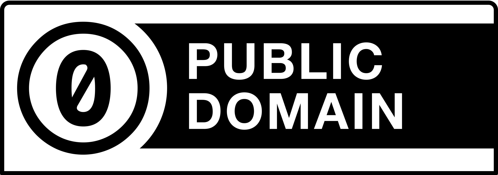

<h3>🔵⚪️🔴<b>Quand_une_idee_est_bonne_elle_appartient_a_tout_le_monde</b>.<i>licence</i></h1>
<h3>🌎🌍🌏<b>When_an_idea_is_good_it_belongs_to_everyone</b>.<i>licence</i></h1>

🔵⚪️🔴 Si vous êtes une bonne personne vous citez vos sources et l'auteur qui vous a inspiré

Sinon , vous vous attribuez la valeur d'une autre personne ou pire vous encaissez les dividendes de son travail
 C'est pas bien joli joli 
Mais j'ai confiance en vous, vous n'etes pas une personne cupide

🌎🌍🌏 If you are a good person you cite your sources and the author who inspired you

Otherwise, you attribute to yourself the value of another person or worse you collect the dividends of his work
 It's not realy nice 
However I believe in you, you are not a greedy person

---
---

🔵⚪️🔴 Tout ce que je produits est en <b>"zero"</b> licence  
Libre a vous d'en faire l'usage dont vous avez besoin ou que vous trouvez utile  

<u>Zero Licence</u> :
<a href="https://creativecommons.org/publicdomain/zero/1.0/deed.fr" target="_blank">https://creativecommons.org/publicdomain/zero/1.0/deed.fr</a>

 <u>Licence Alternative </u> : <a href="https://fr.wikipedia.org/wiki/WTFPL" target="_blank">https://fr.wikipedia.org/wiki/WTFPL</a>

🌎🌍🌏 Everything I produce is under <b>"zero"</b> license  
You are free to use it as you need or find useful  

<u>Zero Licence</u> :
<a href="https://creativecommons.org/publicdomain/zero/1.0/" target="_blank">https://creativecommons.org/publicdomain/zero/1.0/</a>

<u>Licence Alternative </u>
 : <a href="https://en.wikipedia.org/wiki/WTFPL" target="_blank">https://en.wikipedia.org/wiki/WTFPL</a>

<u>GITHUB Guide</u> : https://docs.github.com/fr/repositories/managing-your-repositorys-settings-and-features/customizing-your-repository/licensing-a-repository

### Dfalm
