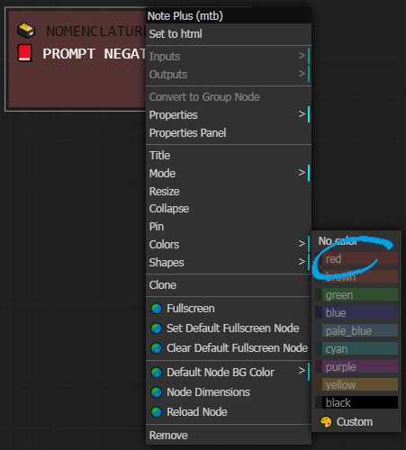

#### Script in French pending translations into English and other languages

# **Divers WorkFlow + Tutos + Config + Misc COMFYui**

## Normalisation
Dans ce chaptire je vais mettre en place une "norme" commune : **Normalisation** pour les différents éléments 
Le premier élément est la Langue 
Pour distinguer le Français de l'Anglais je vais utiliser les icones suivantes : 
🔵⚪️🔴 En Français 
🌎🌍🌏 In English

Autre exemple trivial pour le Prompt Positif je vais utiliser la couleur "vert" et pour le prompt négatif la couleur "rouge" 
Couleur par défaut proposée par COMFYui 
Lorsque ces couleurs sont spécifiques je le préciserais avec le code couleurs

---
In this chapter I will set up a common "standard" aka **Normalisation** for the different elements 
The first element is the Language 
To distinguish French from English I will use the following icons: 
🔵⚪️🔴 In French 
🌎🌍🌏 In English 

Another trivial example for the Positive Prompt I will use the color "green" and for the negative prompt the color "red" 
Default color proposed by COMFYui 
When these colors are specific I will specify it with the color code

---
- PREVIEW
- 1 Variables : En vert / In Green
- 2 Prompts : Couleur / color
- 3 CONTROLS
- 4 Ksampler
- 5 DESACTIVE
- 6 CLIP ENCODE
- 7 CONTROL DE VARIABLES

-----
-----

## WorkFlow
Dans ce chapitre je propose des WorkFlow, les liens des exemples, des images et autres...

----
----

## Misc
Divers à déterminer

Ce **README** est une simple présentation 
( *Plus de détails dans un fichier spécifique* )

##  !!!! ATTENTION !!!!

COMING SOON

-----
-----

<h1 id="attention">🗃️ NORMALISATION </h1>

## Permier / First :  Langue / Language
<h1>🔵⚪️🔴 En Français</h1>
<h1>🌎🌍🌏 In English</h1>

----
- ## PREVIEW
A Gauche 🔵⚪️🔴 En Français // In Right 🌎🌍🌏 In English 
In Left 🔵⚪️🔴 In French // A Droite 🌎🌍🌏 En Anglais
 

----
- ## 1 Variables : En vert / In Green :

>### ⌨️ PARAMETRER A DETERMINER PAR L'UTILISATEUR
>#### C'est une variable à renseigner ou un interrupteur à choix

>### ⌨️ SETTING TO BE DETERMINED BY THE USER
>#### This is a variable to be filled in or a switch of choice

- Couleur / Color : 0 255 0
 

----
- ## 2 Prompts : Couleur / color

>#### 📗 PROMPT positif // positive
>#### 📕 PROMPT négatif // negative

Couleurs par défaut / Default Colors 
 Vert / Green ⬠------------------------ Rouge /Red ⬠

----
- ## 3 CONTROLS
Il s'agit d'un / Is a : "Show Text 🐍" 

J'utilise deux couleurs / I use 2 colors
- CYAN : 0-255-200  

- Safran : 220-200-30 

🔵⚪️🔴 J'utilise les 'controls' pour verifier des variables de retour et donner des informations ; les deux couleurs sont employes en fonction de l'usage (d'autre couleurs peuvent etre utilisees en complement) 
*Par exemple un coefficient multiplicateur pour un UPScale 
Ou le nom complet de l'image lorsqu'on concatene le nom du tenseur et du lora au nom choisis par l'utilisateur* 

🌎🌍🌏I use 'controls' to check return variables and give information; the two colors are used depending on the usage (other colors can be used in addition) 
*For example a multiplier coefficient for a UPScale 
Or the full name of the image when we concatenate the name of the tensor and the lora to the name chosen by the user* 

----
- ## 4 Ksampler

Pour un plus grand contraste j'utilise la couleur rouge --
For greater contrast I use the color red 200-75-75 

----
- ## 5 DESACTIVE

En NOIR (couleur par defaut) / In BLACK (default color)

 
Noeud minimisé / Minimised node 

🔵⚪️🔴 Les noeuds non pertinents qui peuvent encombrer la lecteure et la comprehension du workflow 
Ou des noeuds "operateurs" genre "boite noire" qui font une serie d'action complexe utile au workflow mais dispensable pour l'UTILISATEUR 
🌎🌍🌏 Irrelevant nodes that can clutter the reader and the understanding of the workflow 
Or "operator" nodes like "black box" that make a series of complex actions useful to the workflow but dispensable for the USER

----
- ## 6 CLIP ENCODE

🔵⚪️🔴 Pour le prompt je separe le "CLIP Text Encode (Prompt) en deux parties 
Je convertis le "texte en entree/input" 
🌎🌍🌏 For the prompt I separate the "CLIP Text Encode (Prompt) into two parts 
I convert the "text to input"
 

🔵⚪️🔴 Je relie l'entree a un "String Literal" (par defaut) dans lequel sera renseigne le texte du Prompt 
🌎🌍🌏 I connect the input to a "String Literal" (by default) in which the text of the Prompt will be entered
 

🔵⚪️🔴 J'applique le code couleur ; VERT pour le Prompt positif et ROUGE pour le Prompt negatif 
🌎🌍🌏 I apply the color code; GREEN for the positive Prompt and RED for the negative Prompt

----
- ## 7 CONTROL DIMENSION
- 

- 

🔵⚪️🔴 J'utilse deux contrôles de variables pour controler la taille de l'image ce sont les couleurs par defaut : 
🌎🌍🌏 I use two variable controls to control the size of the image these are the default colors: 
Largeur / Width : bleu_pale 
Hauteur / Height : brown (maron) 

----
- ## 8 MISC

🔵⚪️🔴 Pour la preview image j'utilise egalement la couleur noire et uniquement "PREVIEW IMAGE" 
Je conseille d'utiliser les "SD" Prompt generator et Prompt Saver pour diverses raisons

🌎🌍🌏 For the preview image I also use black color and only "PREVIEW IMAGE" 
I recommend using the "SD" Prompt generator and Prompt Saver for various reasons

VIEILLES VERSIONS DE COMFYui :
https://github.com/comfyanonymous/ComfyUI/tags 
COMFYui Manger : https://github.com/ltdrdata/ComfyUI-Manager?tab=readme-ov-file

github : https://github.com/Dfalm-Original 
Youtube : https://www.youtube.com/@Dfalm
