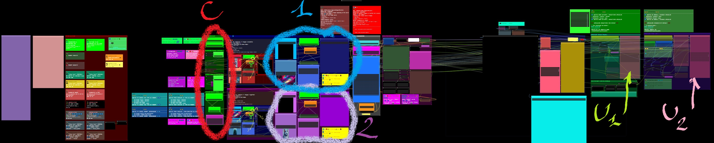
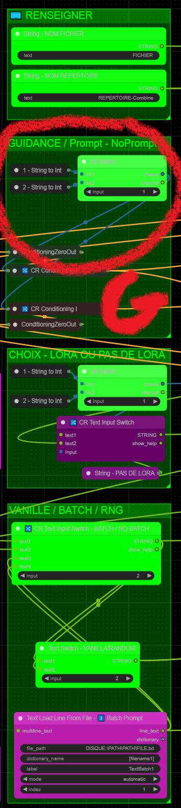
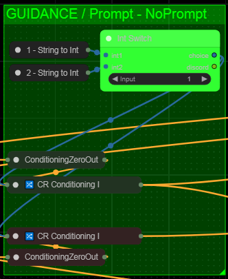
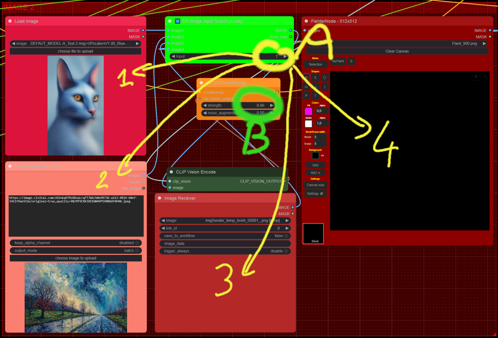
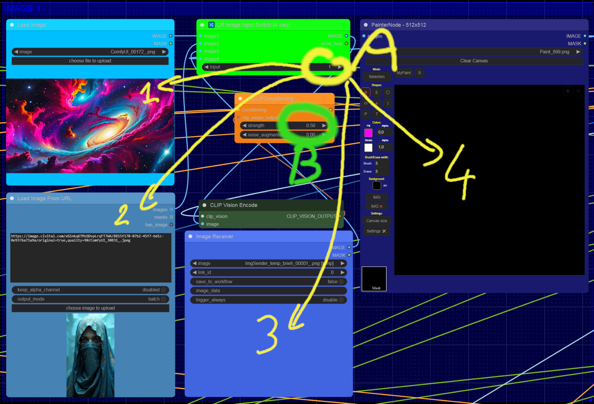

###  Dfalm.<i>[Licence ](https://github.com/Dfalm-Original/COMFYui?tab=License-1-ov-file)</i>
# ** 🚧🚧 WORK IN PROGRESS 🚧🚧  --**

#### A - Normalisation B - WorkFlows C - Misc D - In Fine
----
## INTRODUCTION
Rappel de la "norme" commune : **Normalisation** pour les différents éléments 
Le premier élément est la Langue 
Pour distinguer le Français de l'Anglais je vais utiliser les icones suivantes : 
🔵⚪️🔴 En Français 
🌎🌍🌏 En Anglais

Autre exemple trivial pour le Prompt Positif je vais utiliser la couleur "vert" et pour le prompt négatif la couleur "rouge" 
Couleur par défaut proposée par COMFYui 
Lorsque ces couleurs sont spécifiques je le préciserais avec le code couleurs

---
Reminder of the common "standard" aka **Normalisation** for the different elements 
The first element is the Language 
To distinguish French from English I will use the following icons: 
🔵⚪️🔴 In French 
🌎🌍🌏 In English 

Another trivial example for the Positive Prompt I will use the color "green" and for the negative prompt the color "red" 
Default color proposed by COMFYui 
When these colors are specific I will specify it with the color code

---
## A - Normalisation
#### VOIR LA PAGE AD HOC :  [ <u>README</u> ](https://github.com/Dfalm-Original/COMFYui) REFER TO AD HOC PAGE: [ <u>README</u> ](https://github.com/Dfalm-Original/COMFYui)

-----
-----

## B - WorkFlows
🔵⚪️🔴 Dans ce chapitre je propose des WorkFlow, les liens des exemples, des images et autres... 🌎🌍🌏 In this chapter I propose WorkFlow, links to examples, images and others...

## [RESUME DES WORKFLOWS - WORKFLOWS SUMMARY ](Dfalm_Workflows.md)

0) <u>[BASIC](BASIC.md)</u> - Presentation et bases -- Presentation and basics
1) <u>[DEFAUT_MODEL-A_Text-2-Img+UPscalers](DEFAUT_MODEL-A.md)</u> - Pour generer 'text-to-image' -- To generate 'text-to-image'
2) <u>[DEFAUT_MODEL-B_Load-ImgZ+UPscalers](DEFAUT_MODEL-B.md)</u> - Pour generer 'image(s)-to-image' -- To generate 'image(s)-to-image'
3) <u>[DEFAUT_MODEL-C_Text-2-Img+LoadImage+UPscalers](DEFAUT_MODEL-C.md)</u> - Combine le Modele A et le Modele B -- Combine Model A and Model B
4) <u>[DEFAUT_MODEL-D_Text-2-Img+LoadImage+UPscalers](DEFAUT_MODEL-D.md)</u> - Ameliore le Modele B -- Amelioration of B Model

### 🆙) <u>[Upscalers](Upscalers.md)</u>

## 🚧🚧 WORK IN PROGRESS 🚧🚧

#### 🚨🚨 ATTENTION CE N'EST PAS UNE VERSION FINALE !! VERSION ALPHA 🚨🚨
#### 🚨🚨 ATTENTION THIS IS NOT A FINAL VERSION !! ALPHA VERSION 🚨🚨
5) <u> [INFINITE ZOOM](Infinite-Zoom.md) </u>- Permet de faire des Animation / Video de Zoom Infini -- Allows you to make Infinite Zoom Animation/Video  
> (  exemple 1 : [CIVITAI](https://civitai.com/images/34925284) // exemple 2 : [Youtube](https://youtube.com/shorts/W1ugyeAG0Ys)  )  

6) <u> [Re-COMBINE 2 images](Combine.md)</u>- Permet de recombiner 2 images pour en faire une nouvelle -- Allows you to recombine 2 images to make a new one 
#### 🚨🚨 ATTENTION CE N'EST PAS UNE VERSION FINALE !! VERSION ALPHA 🚨🚨
#### 🚨🚨 ATTENTION THIS IS NOT A FINAL VERSION !! ALPHA VERSION 🚨🚨
## 🚧🚧 WORK IN PROGRESS 🚧🚧 

-----

# 🚧🚧 WORK IN PROGRESS 🚧🚧
## 🚨🚨 ATTENTION CE N'EST PAS UNE VERSION FINALE !! VERSION ALPHA 🚨🚨
## 🚨🚨 ATTENTION THIS IS NOT A FINAL VERSION !! ALPHA VERSION 🚨🚨
# 🚧🚧 WORK IN PROGRESS 🚧🚧

# 🔵⚪️🔴 
# Permet de combiner 2 images ensemble
## IMAGE 1🔵 avec IMAGE 2🔴
[ CLICK TO DOWNLOAD PNG WORKFLOW ] 
<a href="Combine/COMBINE-4TYPES_Images+UPscalers.png">

### Toutes les Options restent comnunes au [ [ modele C ](DEFAUT_MODEL-C.md) ] & au modele [ [BASIC](BASIC.md) ] :
❤️C - Commun / Common 
💚U1 / 💜U2 - Upsacalers 1 & 2  

 

# G ) GUIDANCE 
 

## 🔵⚪️🔴 CHOIX DE GUIDANCE
### [1] Pas de prompt pour guider 
### (2) On ajoute le prompt
( Voir options de prompt )

## 🌎🌍🌏 GUIDANCE CHOICE
### [1] No prompt to guide 
### (2) We add the prompt
( See prompt options )

## <u>Parametres individuels de chaque image</u> : 
A ) SOURCE DE L'IMAGE 4 CHOIX :
- 1 Load Image
- 2 Image From URL
- 3 Reicever ( image generee / reinjecte)
- 4 Painter

B ) INTENSITE DE L'IMAGE 
**0.00** = n'est pas prise en compte  
**1.00** = 100 % 
Conseil ne pas dépasser 90% ( 0.90 ) au-dela de 0.90 l'image a tendance a "deriver" 

 
# 🌎🌍🌏
# Allows you to combine 2 images together
## IMAGE 1🔵 with IMAGE 2🔴
## <u>Individual settings for each image</u>:
A ) IMAGE SOURCE 4 CHOICES:
- 1 Load Image
- 2 Image From URL
- 3 Reicever (generated / reinjected image)
- 4 Painter

B ) IMAGE INTENSITY
**0.00** = not taken into account 
**1.00** = 100% 
Advice do not exceed 90% (0.90) beyond 0.90 the image tends to "drift" 
 

-----
-----

<h1>D - In Fine</h1>

## Liens Utiles - Links usefull :
VIEILLES VERSIONS / OLDS VERSION  <b>COMFYui</b> :
https://github.com/comfyanonymous/ComfyUI/tags 
INDISPENSABLE : <b>COMFYui Manger</b> : https://github.com/ltdrdata/ComfyUI-Manager

### Beginner’s Guide to ComfyUI
By Andrew : https://stable-diffusion-art.com/comfyui/
### Unlock the Power of ComfyUI: A Beginner's Guide with Hands-On Practice
And "RUN WORKFLOW" online : https://www.runcomfy.com/tutorials/comfyui-beginners-guide
### ComfyUI WIKI
Your Ultimate Companion for Mastering Stable Diffusion ComfyUI : https://comfyui-wiki.com

----
### Credit
ComfyUI/[ComfyUI](https://github.com/comfyanonymous/ComfyUI) - A powerful and modular stable diffusion GUI.

**And, for all ComfyUI custom node developers**

🙏 Un grand merci au / Special Thanks to the  : <b>GOAT [ltdrdata](https://github.com/ltdrdata)</b> 
[ComfyUI ltdrdata:FORK](https://github.com/comfyanonymous/ComfyUI) 
[ComfyUI-Manager](https://github.com/ltdrdata/ComfyUI-Manager) 
[ComfyUI-Impact-Pack](https://github.com/ltdrdata/ComfyUI-Impact-Pack) 
[ComfyUI-Inspire-Pack](https://github.com/ltdrdata/ComfyUI-Inspire-Pack) 
[ComfyUI-extension-tutorials](https://github.com/ltdrdata/ComfyUI-extension-tutorials)

----
----
###  Dfalm.<i>[Licence ](https://github.com/Dfalm-Original/COMFYui?tab=License-1-ov-file)</i>

 github : <a href="https://github.com/Dfalm-Original/COMFYui" target="_blank">https://github.com/Dfalm-Original/COMFYui</a>

 Youtube : <a href="https://www.youtube.com/@Dfalm" target="_blank">https://www.youtube.com/@Dfalm</a>
