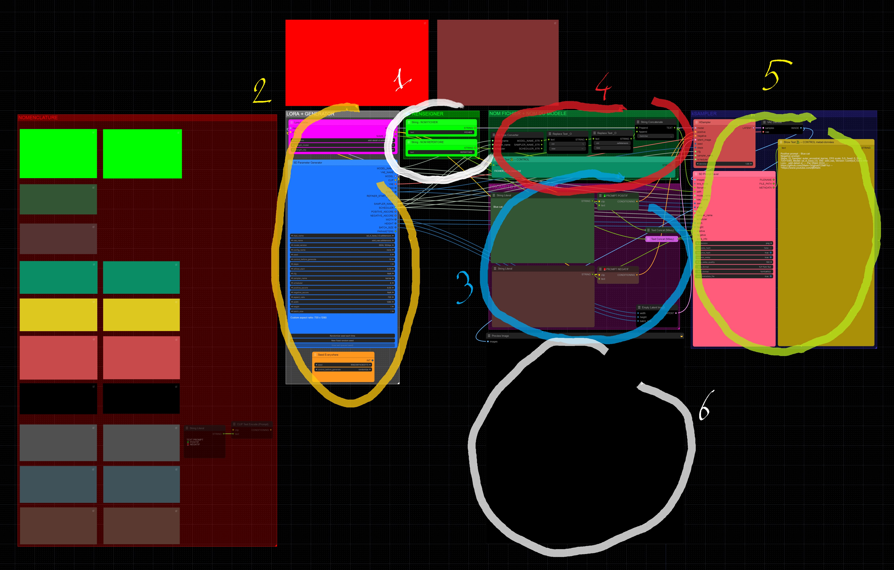
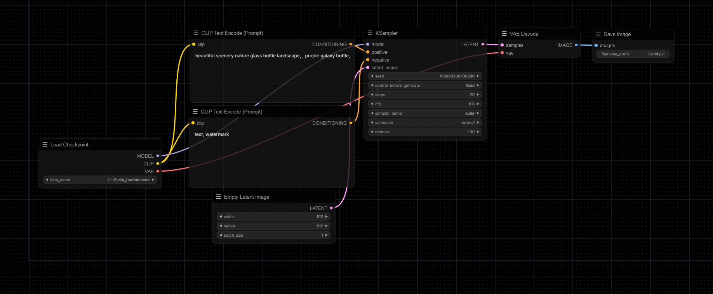
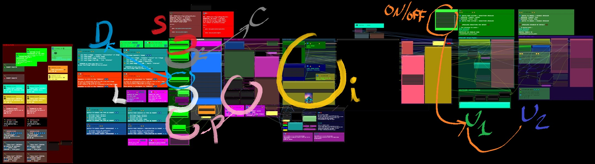
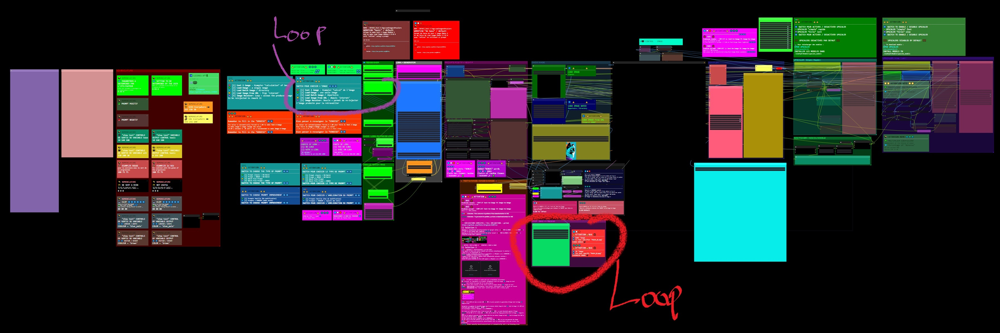
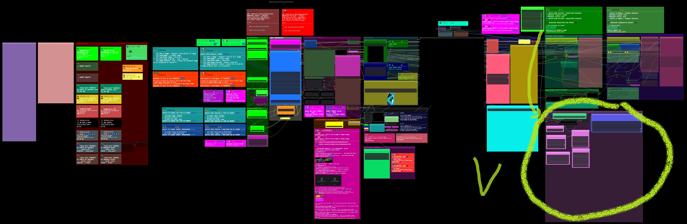
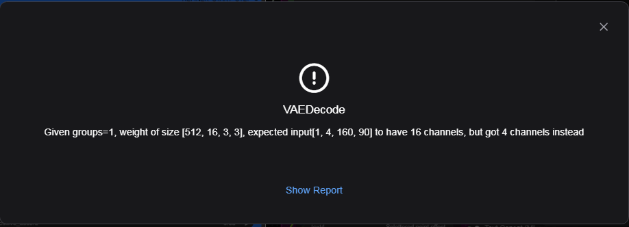
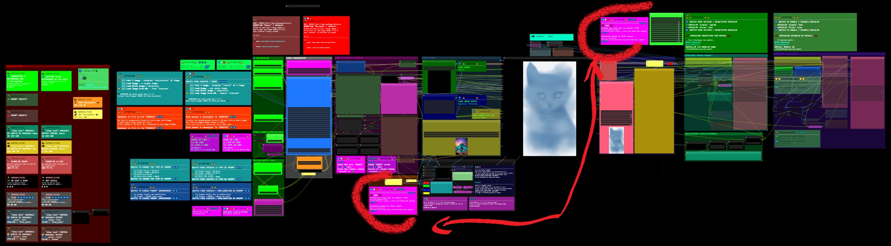
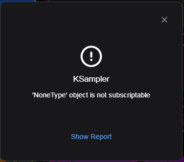
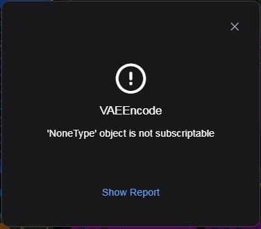
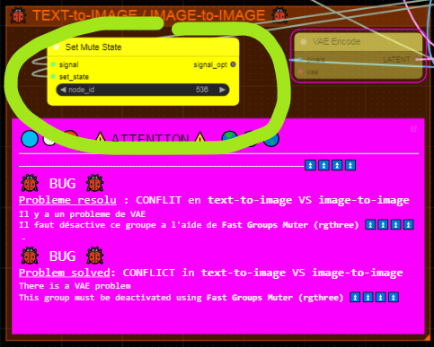

###  Dfalm.<i>[Licence ](https://github.com/Dfalm-Original/COMFYui?tab=License-1-ov-file)</i>
# **-- WorkFlows --**

#### A - Normalisation B - WorkFlows C - Misc D - In Fine
----
## INTRODUCTION
Rappel de la "norme" commune : **Normalisation** pour les différents éléments 
Le premier élément est la Langue 
Pour distinguer le Français de l'Anglais je vais utiliser les icones suivantes : 
🔵⚪️🔴 En Français 
🌎🌍🌏 En Anglais

Autre exemple trivial pour le Prompt Positif je vais utiliser la couleur "vert" et pour le prompt négatif la couleur "rouge" 
Couleur par défaut proposée par COMFYui 
Lorsque ces couleurs sont spécifiques je le préciserais avec le code couleurs

---
Reminder of the common "standard" aka **Normalisation** for the different elements 
The first element is the Language 
To distinguish French from English I will use the following icons: 
🔵⚪️🔴 In French 
🌎🌍🌏 In English 

Another trivial example for the Positive Prompt I will use the color "green" and for the negative prompt the color "red" 
Default color proposed by COMFYui 
When these colors are specific I will specify it with the color code

---
## A - Normalisation
#### VOIR LA PAGE AD HOC :  [ <u>README</u> ](https://github.com/Dfalm-Original/COMFYui) REFER TO AD HOC PAGE: [ <u>README</u> ](https://github.com/Dfalm-Original/COMFYui)

-----
-----

## B - WorkFlows
🔵⚪️🔴 Dans ce chapitre je propose des WorkFlow, les liens des exemples, des images et autres... 🌎🌍🌏 In this chapter I propose WorkFlow, links to examples, images and others...

## [RESUME DES WORKFLOWS - WORKFLOWS SUMMARY ](Dfalm_Workflows.md)

0) <u>[BASIC](BASIC.md)</u> - Presentation et bases -- Presentation and basics
1) <u>[DEFAUT_MODEL-A_Text-2-Img+UPscalers](DEFAUT_MODEL-A.md)</u> - Pour generer 'text-to-image' -- To generate 'text-to-image'
2) <u>[DEFAUT_MODEL-B_Load-ImgZ+UPscalers](DEFAUT_MODEL-B.md)</u> - Pour generer 'image(s)-to-image' -- To generate 'image(s)-to-image'
3) <u>[DEFAUT_MODEL-C_Text-2-Img+LoadImage+UPscalers](DEFAUT_MODEL-C.md)</u> - Combine le Modele A et le Modele B -- Combine Model A and Model B
4) <u>[DEFAUT_MODEL-D_Text-2-Img+LoadImage+UPscalers](DEFAUT_MODEL-D.md)</u> - Ameliore le Modele C -- Amelioration of C Model
5) <u>[DEFAUT_MODEL-E_Text-2-Img+LoadImage+UPscalers+Video](DEFAUT_MODEL-E.md)</u> - Modele D avec ajout de "mini video" -- Model D with addition of "mini video"

### 🆙) <u>[Upscalers](Upscalers.md)</u>

## 🚧🚧 WORK IN PROGRESS 🚧🚧

#### 🚨🚨 ATTENTION CE N'EST PAS UNE VERSION FINALE !! VERSION ALPHA 🚨🚨
#### 🚨🚨 ATTENTION THIS IS NOT A FINAL VERSION !! ALPHA VERSION 🚨🚨
5) <u> [INFINITE ZOOM](Infinite-Zoom.md) </u>- Permet de faire des Animation / Video de Zoom Infini -- Allows you to make Infinite Zoom Animation/Video  
> (  exemple 1 : [CIVITAI](https://civitai.com/images/34925284) // exemple 2 : [Youtube](https://youtube.com/shorts/W1ugyeAG0Ys)  )  

6) <u> [Re-COMBINE 2 images](Combine.md)</u>- Permet de recombiner 2 images pour en faire une nouvelle -- Allows you to recombine 2 images to make a new one 
#### 🚨🚨 ATTENTION CE N'EST PAS UNE VERSION FINALE !! VERSION ALPHA 🚨🚨
#### 🚨🚨 ATTENTION THIS IS NOT A FINAL VERSION !! ALPHA VERSION 🚨🚨
## 🚧🚧 WORK IN PROGRESS 🚧🚧 

## 0) BASIC
[ CLICK TO DOWNLOAD PNG WORKFLOW ] 
 

🔵⚪️🔴  Remplace le workflow **"default"**   🌎🌍🌏 Replaces **"default"** workflow 
 

## 🔵⚪️🔴 VOIR LE WORKFLOW EN DETAIL  [ CLICK ] [BASIC](BASIC.md) 🌎🌍🌏 SEE THE WORKFLOW IN DETAIL [ CLICK ] [BASIC](BASIC.md)

### - Pour les UPScaler voir le chapitre idoine / UPScaler go to : <u>🆙 [Upscalers](Upscalers.md) </u>

## I) -A-  DEFAUT_MODEL-A_Text-2-Img+UPscalers
[ CLICK TO DOWNLOAD PNG WORKFLOW ] 
   

## 🔵⚪️🔴 Permet de faire *text-to-image* avec des options de *prompts* et la possibilité d'*UPScaler* l'image rendue  
#### ( Par defaut les deux UPscalers sont désactivés ❌ )
### Toutes les Options restent comnunes [ [BASIC](BASIC.md) ] :

## 🌎🌍🌏 Allows to do *text-to-image* with *prompts* options and the ability to *UPScaler* the rendered image  
#### ( By default both UPscalers are disabled ❌ )
### All Options remain common [ [BASIC](BASIC.md) ] :

## 🔵⚪️🔴 VOIR LE WORKFLOW EN DETAIL  [ CLICK ] [DEFAUT_MODEL-A_Text-2-Img+UPscalers](DEFAUT_MODEL-A.md) 🌎🌍🌏 SEE THE WORKFLOW IN DETAIL [ CLICK ] [DEFAUT_MODEL-A_Text-2-Img+UPscalers](DEFAUT_MODEL-A.md)

### - Pour les UPScaler voir le chapitre idoine / UPScaler go to : <u>🆙 [Upscalers](Upscalers.md) </u>

## II) -B- DEFAUT_MODEL-B_Load-ImgZ+UPscalers
[ CLICK TO DOWNLOAD PNG WORKFLOW ] 
 

## 🔵⚪️🔴 Permet d'Upscaler des images avec 2 Upscalers 
#### ( Par defaut l'UPscaler "Hires/Lent" U2💜 est désactivé ❌ )
### Toutes les Options restent comnunes [ [BASIC](BASIC.md) ] :

## 🌎🌍🌏 Allows to Upscale images with 2 Upscalers 
#### ( By default the "Hires/Lent" U2💜 UPscaler is disabled ❌ )
### All Options remain common [ [BASIC](BASIC.md) ] :

## 🔵⚪️🔴 VOIR LE WORKFLOW EN DETAIL  [ CLICK ] [DEFAUT_MODEL-B_Load-ImgZ+UPscalers](DEFAUT_MODEL-B.md) 🌎🌍🌏 SEE THE WORKFLOW IN DETAIL [ CLICK ] [DEFAUT_MODEL-B_Load-ImgZ+UPscalers](DEFAUT_MODEL-B.md)

### - Pour les UPScaler voir le chapitre idoine / UPScaler go to : <u>🆙 [Upscalers](Upscalers.md) </u>

## III) - C - DEFAUT_MODEL-C_Text-2-Img+LoadImage+UPscalers 
[ CLICK TO DOWNLOAD PNG WORKFLOW ] 
<a href="Defaut/DEFAUT_MODEL-C_Text-2-Img+LoadImage+UPscalers.png">

### 🐞 BUG TRIVIAL 🐞 : - Bug Section
## 🔵⚪️🔴 Combine le Modele A et le Modele B 
A - Permet de faire *text-to-image* avec des options de *prompts*  
B - Permet de faire du *image-to-image* avec des options de *prompts* avec l'option '**denoise**' ( **💙 D** ) 
### Toutes les Options restent comnunes [ [BASIC](BASIC.md) ] :

## 🌎🌍🌏 Combines Model A and Model B 
A - Allows you to do *text-to-image* with *prompts* options  
B - Allows you to do *image-to-image* with *prompts* options with the '**denoise**' option ( **💙 D** ) 
### All Options remain common [ [BASIC](BASIC.md) ] :

## 🔵⚪️🔴 VOIR LE WORKFLOW EN DETAIL  [ CLICK ] [DEFAUT_MODEL-C_Text-2-Img+LoadImage+UPscalers](DEFAUT_MODEL-C.md)  🌎🌍🌏 SEE THE WORKFLOW IN DETAIL [ CLICK ] [DEFAUT_MODEL-C_Text-2-Img+LoadImage+UPscalers](DEFAUT_MODEL-C.md)

### - Pour les UPScaler voir le chapitre idoine / UPScaler go to : <u>🆙 [Upscalers](Upscalers.md) </u>

## IV) - D - DEFAUT_MODEL-D_Text-2-Img+LoadImage+UPscalers + Boucle (Loop)
[ CLICK TO DOWNLOAD PNG WORKFLOW ] 
<a href="Defaut/DEFAUT_MODEL-D_Text-2-Img+LoadImage+UPscalers.png">

### 🐞 BUG TRIVIAL 🐞 : - Bug Section
## 🔵⚪️🔴 Modele C Ameliore  
Rajoute une boucle (❤️ Loop) et permet de re-injecter l'image generer pour la retravailler

## - **💜Loop** Choix de generation d'image
Choisir entre 5 options :
- [1] <b>text 2 image </b> -  Ksampler "calcul" de l'image  
- [2] <b>Load-Image </b>: une seule image  
- [3] <b>Load Batch image </b> / répertoire   
- [4] <b>Load Image From URL </b>: depuis 'internet'  
- Option 5 : 💜 [5]  <b>Image Receiver</b> Boucle = permet de re-injecter l'image produite pour la retravailler 

### Toutes les Options restent comnunes au [ [ modele C ](DEFAUT_MODEL-C.md) ] & au modele [ [BASIC](BASIC.md) ] :

## 🌎🌍🌏 Improved Model C  
Adds a ❤️Loop and allows to re-inject the generated image to rework it

## - **💜Loop** Image generation choice
Choose between 5 options:
- [1] <b>text 2 image</b> - Ksampler "calculation" of the image  
- [2] <b>Load-Image</b>: a single image  
- [3] <b>Load Batch image</b> / directory  
- [4] <b>Load Image From URL</b>: from 'internet'  
- Option 5 : 💜 [5]  <b>Image Receiver</b>Loop = allows you to re-inject the image produced to rework it 

### All Options remain common to the [ [ C model ](DEFAUT_MODEL-C.md) ] & to the [ [BASIC](BASIC.md) ] model:

## 🔵⚪️🔴 VOIR LE WORKFLOW EN DETAIL  [ CLICK ] [DEFAUT_MODEL-D_Text-2-Img+LoadImage+UPscalers](DEFAUT_MODEL-D.md)  🌎🌍🌏 SEE THE WORKFLOW IN DETAIL [ CLICK ] [DEFAUT_MODEL-D_Text-2-Img+LoadImage+UPscalers](DEFAUT_MODEL-D.md)

### - Pour les UPScaler voir le chapitre idoine / UPScaler go to : <u>🆙 [Upscalers](Upscalers.md) </u>

## V) - E -DEFAUT_MODEL-E_Text-2-Img+LoadImage+UPscalers+Video
[ CLICK TO DOWNLOAD PNG WORKFLOW ] 
<a href="Defaut/DEFAUT_MODEL-E_Text-2-Img+LoadImage+UPscalers+Video.png">

### 🐞 BUG TRIVIAL 🐞 : - Bug Section
## 🔵⚪️🔴 Modele D Ameliore Il s'agit du Modele D avec l'ajout de "mini" video **V⚪️**

## - **⚪️ Video on/off
Pour les options voir le GitHub de **[akatz-ai](https://github.com/akatz-ai)** : <u>[ComfyUI-Depthflow-Nodes](https://github.com/akatz-ai/ComfyUI-Depthflow-Nodes)</u>

### Toutes les Options restent comnunes au [ [ modele D ](DEFAUT_MODEL-D.md) ] & au modele [ [BASIC](BASIC.md) ] :

## 🌎🌍🌏 Modele D Ameliorations This is Modele D with the addition of "mini" video **V⚪️**
## - **⚪️ Video on/off
For options see the GitHub of **[akatz-ai](https://github.com/akatz-ai)**: <u>[ComfyUI-Depthflow-Nodes](https://github.com/akatz-ai/ComfyUI-Depthflow-Nodes)</u>

### All Options remain common to the [ [ D model ](DEFAUT_MODEL-D.md) ] & to the [ [BASIC](BASIC.md) ] model:

## 🔵⚪️🔴 VOIR LE WORKFLOW EN DETAIL  [ CLICK ] [DEFAUT_MODEL-E_Text-2-Img+LoadImage+UPscalers+Video](DEFAUT_MODEL-E.md) 🌎🌍🌏 SEE THE WORKFLOW IN DETAIL [ CLICK ] [DEFAUT_MODEL-E_Text-2-Img+LoadImage+UPscalers+Video](DEFAUT_MODEL-E.md)

### - Pour les UPScaler voir le chapitre idoine / UPScaler go to : <u>🆙 [Upscalers](Upscalers.md) </u>

## 🆙) Upscalers :
### Hires - Lent / Slow  

Il y a deux Upscalers, un rapide et un "lent" qui fait du refiner

## 🔵⚪️🔴 VOIR LES DETAILS  [ CLICK ] [Upscalers](Upscalers.md) 🌎🌍🌏 SEE DETAILS [ CLICK ] [Upscalers](Upscalers.md)

## ℹ️ INFORMATION : 
## 📥 Telecharger des modeles / download models :
 [OPEN UPSCALER](https://openmodeldb.info) : https://openmodeldb.info
#### INSTALLER LES MODELES DANS / INSTALL MODELS IN

.\ComfyUI\Models\upscale_models

-----
-----

<h1>C - MISC</h1>

### Conseil / Advice
🔵⚪️🔴 Pour la preview image j'utilise egalement la couleur noire et uniquement "PREVIEW IMAGE" 
Je conseille d'utiliser les "SD" Prompt generator et Prompt Saver 1️⃣ pour diverses raisons

🌎🌍🌏 For the preview image I also use black color and only "PREVIEW IMAGE" 
I recommend using the "SD" Prompt generator and Prompt Saver 1️⃣ for various reasons

1️⃣ SD Prompt Reader Node : https://github.com/receyuki/comfyui-prompt-reader-node 

# BUG

## 🐞 BUG TRIVIAL 🐞  
#### 🔵⚪️🔴  Specifique aux <u>[ 'MODEL-C' ](DEFAUT_MODEL-C.md)</u> & <u>[ 'MODEL-D' ](DEFAUT_MODEL-D.md)</u>
#### 🌎🌍🌏  Specific to <u>[ 'MODEL-C' ](DEFAUT_MODEL-C.md)</u> & <u>[ 'MODEL-D' ](DEFAUT_MODEL-D.md)</u>

🔵⚪️🔴 Il y a un BUG  resolu : C'est un conflit entre ** text-to-image** VS **image-to-image** : <u>erreur VAE</u> 
🌎🌍🌏 There is a BUG fixed: It is a conflict between ** text-to-image** VS ** image-to-image** : <u>VAE error</u>  

🔵⚪️🔴  2 Solutions : Pour contourner le probleme il faut desactiver/activer la VAE     
<u>Solution 1</u> : Manuellement desactiver/activer le "groupe" ad-hoc : **[ 🐞 TEXT-to-IMAGE / IMAGE-to-IMAGE 🐞 ]** 
🌎🌍🌏 2 Solutions : To get around the problem, you have to deactivate/activate the VAE  
<u>Solution 1</u>: Manually deactivate/activate the ad-hoc "group": **[ 🐞 TEXT-to-IMAGE / IMAGE-to-IMAGE 🐞 ]** 
 
✅ ACITIVE = TEXT-to-IMAGE  // ❌ DESACTIVE = IMAGE-to-IMAGE

🔵⚪️🔴 <u>Solution 2</u> : Automatiquement = ne rien faire   J'ai ajoute un noeud auto *mutte / demutte* qui actionne automatiquement la solution 1 
( Mais il y a un inconvenient 📑 ) 
Lancer la queue normalement une erreur va apparaitre : [ KSampler ] ou [ VAEENCODE ] 
🌎🌍🌏 <u>Solution 2</u>: Automatically = do nothing  I added an auto node *mutte / demutte* which automatically activates solution 1 
( But there is a drawback 📑 ) 
Launch the queue normally an error will appear: [ KSampler ] or [ VAEENCODE ] 
 

🔵⚪️🔴 Il suffit de relancer la queue pour que ça fonctionne correctement
### 📑 L'erreur se reproduira au premier changement text-to-image 🔂 image-to-text

🌎🌍🌏 Just restart the queue for it to work properly
### 📑 The error will reoccur on the first text-to-image change 🔂 image-to-text

### 🔵⚪️🔴 <u> EXPLICATION</u> L’interrupteur "auto mutte" fonctionne avec un cycle de retard 🌎🌍🌏 <u>EXPLANATION</u> The "auto mute" switch operates with a delay cycle 
 
🔵⚪️🔴 Si la VAE est dans un etat (ON📲/📴OFF) et qu'on permutte la generation d'image text-to-image 🔂 image-to-text   
Lorsqu'on a va generer la nouvelle image avec le nouveau choix( image-to-text 🔂 text-to-image ) la VAE est n'est pas dans l'etat correct (📴OFF/ON📲) 
1) Ca provoque l'erreur [ KSampler ] ou [ VAEENCODE ]   
2) L'etat de la VAE bascule dans l'etat correct (ON📲/📴OFF) : on peut desormais generer l'image

🌎🌍🌏 If the VAE is in a state (ON📲/📴OFF) and we switch the image generation text-to-image 🔂 image-to-text 
When we are going to generate the new image with the new choice (image-to-text 🔂 text-to-image) the VAE is not in the correct state (📴OFF/ON📲) 
1) This causes the error [ KSampler ] or [ VAEENCODE ] 
2) The state of the VAE switches to the correct state (ON📲/📴OFF): we can now generate the image

### 🔵⚪️🔴 Soit on desactive/active manuellement soit en automatique avec une erreur non bloquante 🌎🌍🌏 Either manually deactivate/activate or automatically with a non-blocking error
 

### VOIR LA PAGE AD HOC :  [ <u>README - Section Bugs</u> ](https://github.com/Dfalm-Original/COMFYui) REFER TO AD HOC PAGE:[ <u>README - Bugs Section </u>](https://github.com/Dfalm-Original/COMFYui)

---

<h1>D - In Fine</h1>

## Liens Utiles - Links usefull :
VIEILLES VERSIONS / OLDS VERSION  <b>COMFYui</b> :
https://github.com/comfyanonymous/ComfyUI/tags 
INDISPENSABLE : <b>COMFYui Manger</b> : https://github.com/ltdrdata/ComfyUI-Manager

### Beginner’s Guide to ComfyUI
By Andrew : https://stable-diffusion-art.com/comfyui/
### Unlock the Power of ComfyUI: A Beginner's Guide with Hands-On Practice
And "RUN WORKFLOW" online : https://www.runcomfy.com/tutorials/comfyui-beginners-guide
### ComfyUI WIKI
Your Ultimate Companion for Mastering Stable Diffusion ComfyUI : https://comfyui-wiki.com

----
### Credit
ComfyUI/[ComfyUI](https://github.com/comfyanonymous/ComfyUI) - A powerful and modular stable diffusion GUI.

**And, for all ComfyUI custom node developers**

🙏 Un grand merci au / Special Thanks to the  : <b>GOAT [ltdrdata](https://github.com/ltdrdata)</b> 
[ComfyUI ltdrdata:FORK](https://github.com/comfyanonymous/ComfyUI) 
[ComfyUI-Manager](https://github.com/ltdrdata/ComfyUI-Manager) 
[ComfyUI-Impact-Pack](https://github.com/ltdrdata/ComfyUI-Impact-Pack) 
[ComfyUI-Inspire-Pack](https://github.com/ltdrdata/ComfyUI-Inspire-Pack) 
[ComfyUI-extension-tutorials](https://github.com/ltdrdata/ComfyUI-extension-tutorials)

----
----
###  Dfalm.<i>[Licence ](https://github.com/Dfalm-Original/COMFYui?tab=License-1-ov-file)</i>

 github : <a href="https://github.com/Dfalm-Original/COMFYui" target="_blank">https://github.com/Dfalm-Original/COMFYui</a>

 Youtube : <a href="https://www.youtube.com/@Dfalm" target="_blank">https://www.youtube.com/@Dfalm</a>
