###  Dfalm.<i>[Licence ](https://github.com/Dfalm-Original/COMFYui?tab=License-1-ov-file)</i>

#### A - Normalisation B - WorkFlows C - Misc D - In Fine
----
## INTRODUCTION
Rappel de la "norme" commune : **Normalisation** pour les différents éléments 
Le premier élément est la Langue 
Pour distinguer le Français de l'Anglais je vais utiliser les icones suivantes : 
🔵⚪️🔴 En Français 
🌎🌍🌏 En Anglais

Autre exemple trivial pour le Prompt Positif je vais utiliser la couleur "vert" et pour le prompt négatif la couleur "rouge" 
Couleur par défaut proposée par COMFYui 
Lorsque ces couleurs sont spécifiques je le préciserais avec le code couleurs

---
Reminder of the common "standard" aka **Normalisation** for the different elements 
The first element is the Language 
To distinguish French from English I will use the following icons: 
🔵⚪️🔴 In French 
🌎🌍🌏 In English 

Another trivial example for the Positive Prompt I will use the color "green" and for the negative prompt the color "red" 
Default color proposed by COMFYui 
When these colors are specific I will specify it with the color code

---
## A - Normalisation
#### VOIR LA PAGE AD HOC :  [ <u>README</u> ](https://github.com/Dfalm-Original/COMFYui) REFER TO AD HOC PAGE: [ <u>README</u> ](https://github.com/Dfalm-Original/COMFYui)

-----
-----

## B - WorkFlows
🔵⚪️🔴 Dans ce chapitre je propose des WorkFlow, les liens des exemples, des images et autres... 🌎🌍🌏 In this chapter I propose WorkFlow, links to examples, images and others...

## [RESUME DES WORKFLOWS - WORKFLOWS SUMMARY ](Dfalm_Workflows.md)

0) <u>[BASIC](BASIC.md)</u> - Presentation et bases -- Presentation and basics
1) <u>[DEFAUT_MODEL-A_Text-2-Img+UPscalers](DEFAUT_MODEL-A.md)</u> - Pour generer 'text-to-image' -- To generate 'text-to-image'
2) <u>[DEFAUT_MODEL-B_Load-ImgZ+UPscalers](DEFAUT_MODEL-B.md)</u> - Pour generer 'image(s)-to-image' -- To generate 'image(s)-to-image'
3) <u>[DEFAUT_MODEL-C_Text-2-Img+LoadImage+UPscalers](DEFAUT_MODEL-C.md)</u> - Combine le Modele A et le Modele B -- Combine Model A and Model B
4) <u>[DEFAUT_MODEL-D_Text-2-Img+LoadImage+UPscalers](DEFAUT_MODEL-D.md)</u> - Ameliore le Modele B -- Amelioration of B Model

### 🆙) <u>[Upscalers](Upscalers.md)</u>

## 🚧🚧 WORK IN PROGRESS 🚧🚧

#### 🚨🚨 ATTENTION CE N'EST PAS UNE VERSION FINALE !! VERSION ALPHA 🚨🚨
#### 🚨🚨 ATTENTION THIS IS NOT A FINAL VERSION !! ALPHA VERSION 🚨🚨
5) <u> [INFINITE ZOOM](Infinite-Zoom.md) </u>- Permet de faire des Animation / Video de Zoom Infini -- Allows you to make Infinite Zoom Animation/Video  
> (  exemple 1 : [CIVITAI](https://civitai.com/images/34925284) // exemple 2 : [Youtube](https://youtube.com/shorts/W1ugyeAG0Ys)  )  

6) <u> [Re-COMBINE 2 images](Combine.md)</u>- Permet de recombiner 2 images pour en faire une nouvelle -- Allows you to recombine 2 images to make a new one 
#### 🚨🚨 ATTENTION CE N'EST PAS UNE VERSION FINALE !! VERSION ALPHA 🚨🚨
#### 🚨🚨 ATTENTION THIS IS NOT A FINAL VERSION !! ALPHA VERSION 🚨🚨
## 🚧🚧 WORK IN PROGRESS 🚧🚧 

-----
-----

# 🚧🚧 WORK IN PROGRESS 🚧🚧
## 🚨🚨 ATTENTION CE N'EST PAS UNE VERSION FINALE !! VERSION ALPHA 🚨🚨
## 🚨🚨 ATTENTION THIS IS NOT A FINAL VERSION !! ALPHA VERSION 🚨🚨
# 🚧🚧 WORK IN PROGRESS 🚧🚧

# 🔵⚪️🔴 Permet de faire des Zooms infinis  🌎🌍🌏 Allows infinite zooms
[ CLICK TO DOWNLOAD PNG WORKFLOW ] 
 

# Vue d'ensemble - Overview
 
1) Nom du fichier + Repertoire - File name + Directory
2) Rotation ( Angle en Degre° ) - Rotation (Angle in Degrees)
3) Zoom ( facteur de zoom ) - Zoom (zoom factor)
4) Taille de l'image L/H - Image size W/H
5) Prompt positif - Positive prompt
6) MAIN : Checkpoint, Lora, seed
7) INITIATEUR : 1/ Creer une Image 2/ Generer le Zoom - NITIATOR: 1/ Create an Image 2/ Generate the Zoom
 

G ) Genere l'image - Generate the image 
RG) Random Step / cfg pour creer de l'aleatoire - To generate randomness 
B ) Boucle de zoom - Zoom loop 
Z ) Zoom de l'image - Zoom image 
C1 ) Controles de l'image + redimensionnement  
RZ ) Zoom Random Step / cfg pour creer de l'aleatoire - To generate randomness 
MATH/TRIGO ) Effectue la roation de l'image en respectant le ratio d'origine - Rotate the image respecting the original ratio 
C2 ) Controles de l'image Finale - Final image controls 
CR ) Controle et Forcage de la taille de l'image - Control and force the image size 
S ) Sauvegarde de l'image et options - Save the image and options 
COMPTEUR ) Compte le nombre d'images generees pour le zoom - Counts the number of images generated for zooming 

# DETAILS  
### 1) Nom du fichier + Repertoire - File name + Directory 
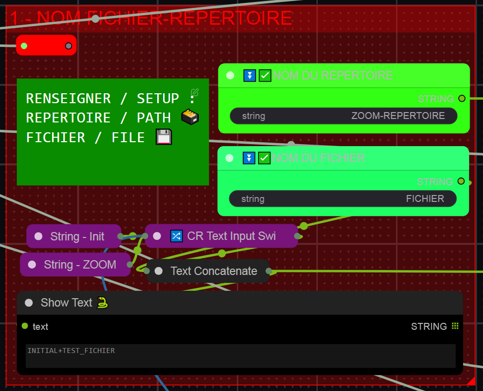 
🔵⚪️🔴 Le nom et le type d'image est automatiquement permutee entre l'image "initiale" et les images generees pour le zoom : voir <b>S) Sauvegarde de l'image et options</b> 
🌎🌍🌏 The image name and type is automatically swapped between the "initial" image and the images generated for zooming: see <b>S) Image saving and options</b> 

### 2) Rotation ( Angle en Degre° )  - Rotation (Angle in Degrees)  
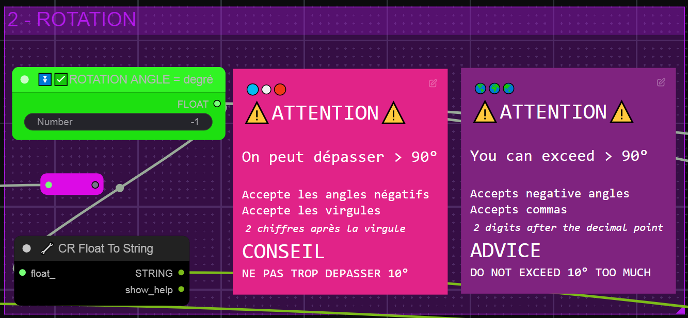 
Accepte les Angles negatifs et les virgules 
Accepts negative angles and commas 
### 3) Zoom ( facteur de zoom ) - Zoom (zoom factor) 
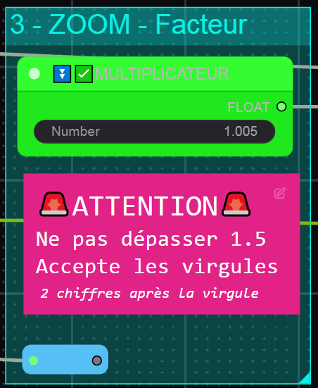 
Accepte les virgules
### 4) Taille de l'image L/H - Image size W/H 
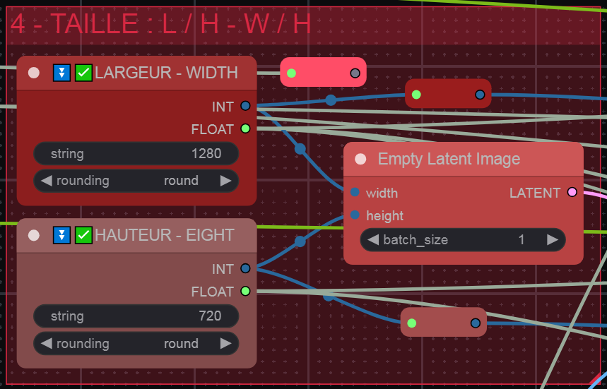 
Permet de faire du portrait, paysage ou 1/1 et tous autres formats
### 5) Prompt positif - Positive prompt 
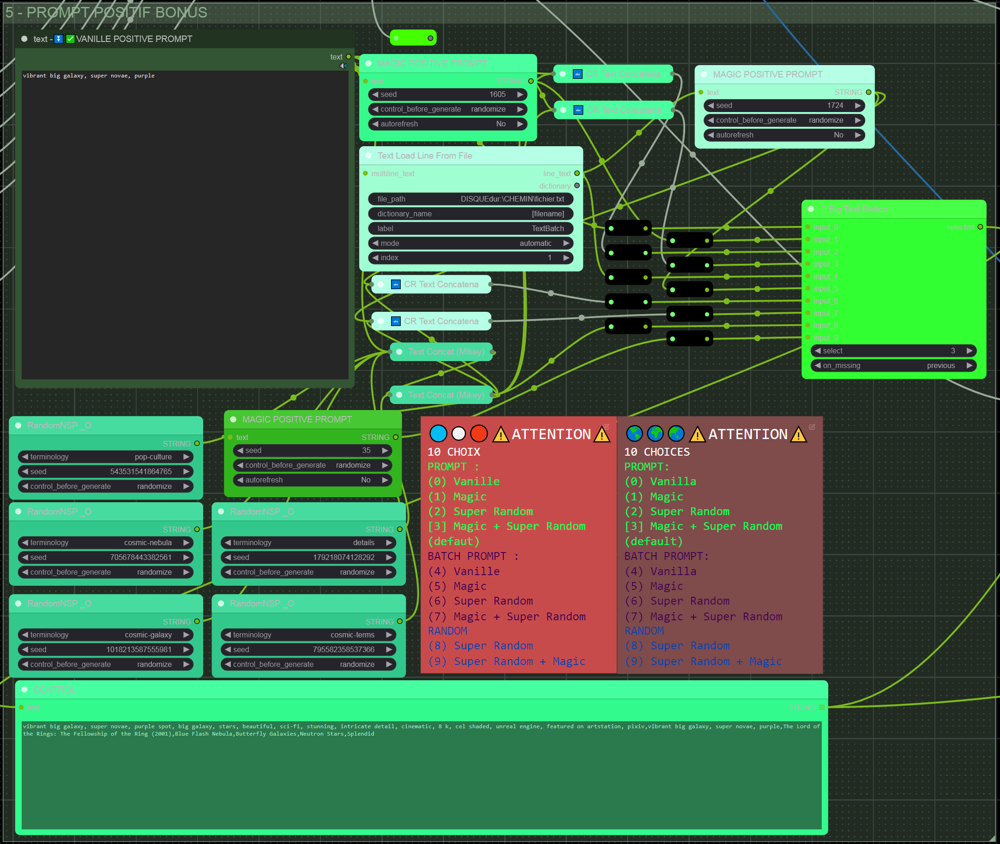 
Toutes les options de Prompts
## 🔵⚪️🔴⚠️ATTENTION⚠️
### 10 CHOIX  PROMPT : 
(0) Vanille 
(1) Magic 
(2) Super Random 
[3] Magic + Super Random (defaut) 

BATCH PROMPT   : 
(4) Vanille 
(5) Magic 
(6) Super Random 
(7) Magic + Super Random

RANDOM
 
(8) Super Random 
(9) Super Random + Magic

## 🌎🌍🌏⚠️ATTENTION⚠️
### 10 CHOICES  PROMPT: 
(0) Vanilla 
(1) Magic 
(2) Super Random 
[3] Magic + Super Random (default) 
 BATCH PROMPT: 
(4) Vanilla 
(5) Magic 
(6) Super Random 
(7) Magic + Super Random 
RANDOM  
(8) Super Random 
(9)Super Random + Magic 

### 6) MAIN : Checkpoint, Lora, seed 
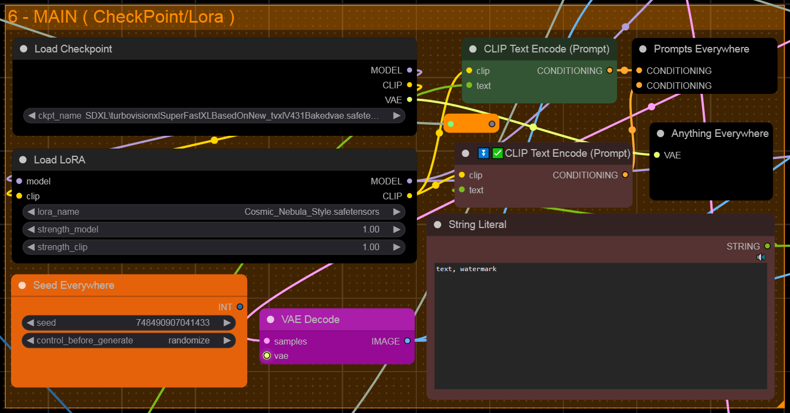 
Choisir le Tenseur (Checkpoint), le Lora et la Seed

### 7) INITIATEUR  - INITIATOR:
1/ Creer la premiere Image - Create first Image 
2/ Generer le Zoom - Generate the Zoom 
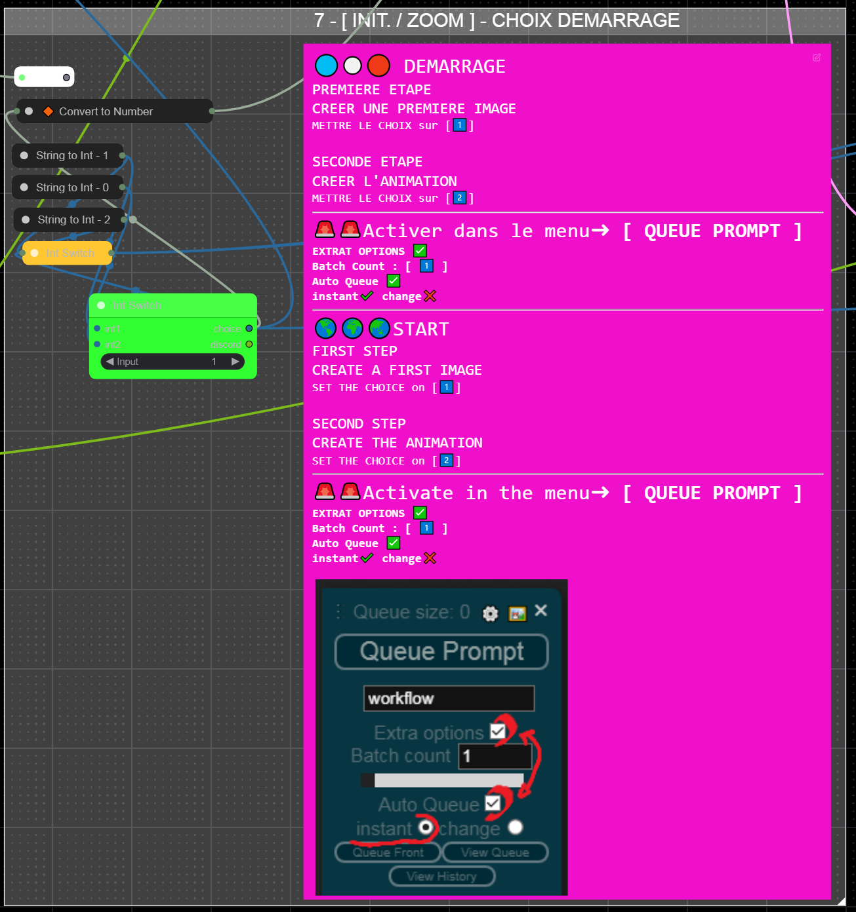 
🔵⚪️🔴 Permet de creer une premiere image ou d'en regenerer une nouvelle 
Une fois satisfait il faut permuter sur le choix (2) pour generer le Zoom 
🌎🌍🌏 Allows you to create a first image or regenerate a new one 
Once satisfied, you must switch to choice (2) to generate the Zoom 
## ⚠️ ATTENTION : Suivre les instructions -- Follow Instructions ⚠️
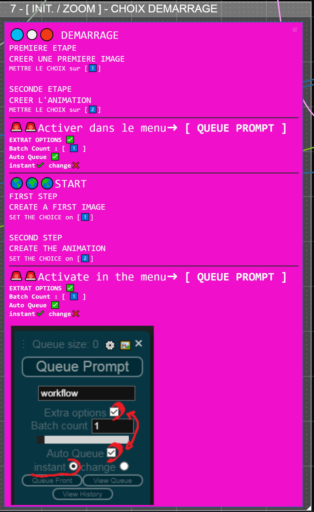 

### G ) Genere l'image 
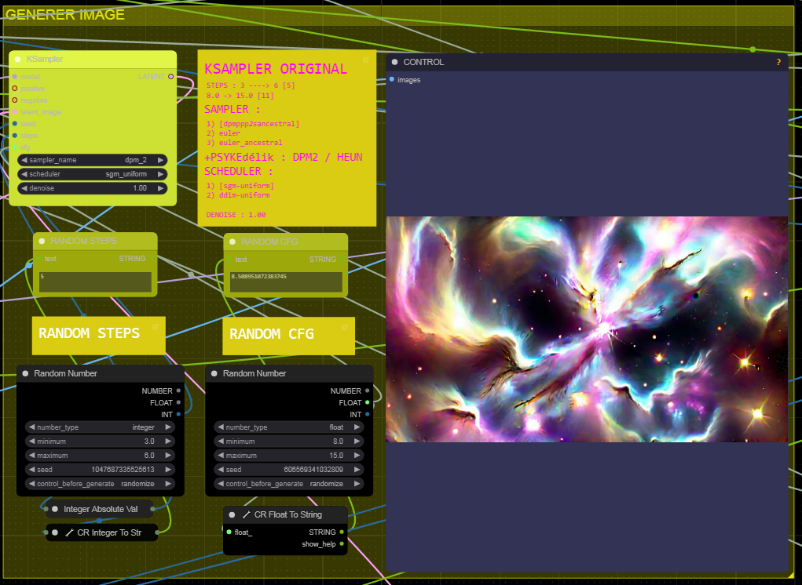 
Par defaut : <b>SAMPLER</b> : dpm_2 -- <b>Scheduleur</b> : sgm_uniform 

### RG ) Random Step / cfg pour creer de l'aleatoire 
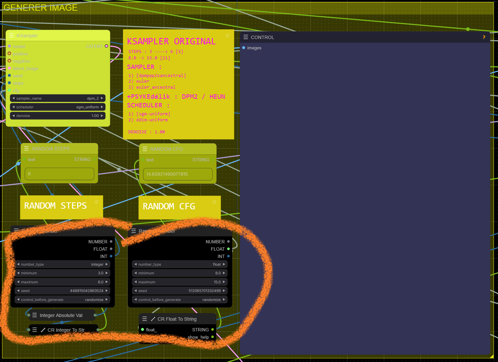 
Permet de cadrer - Restrict  step / cfg 
Step entre - Between { 3 ; 6 } -- cfg entre - Between {8.0 ; 15.0 }

### B ) Boucle de zoom 
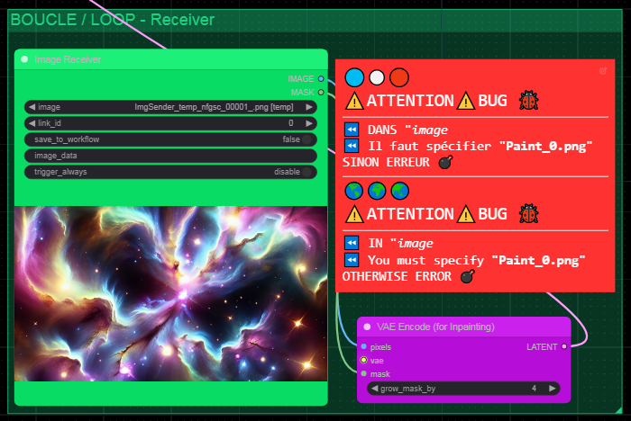 
Image qui sera re-injecter pour generer une nouvelle image pour le zoom 

### Z ) Zoom de l'image 
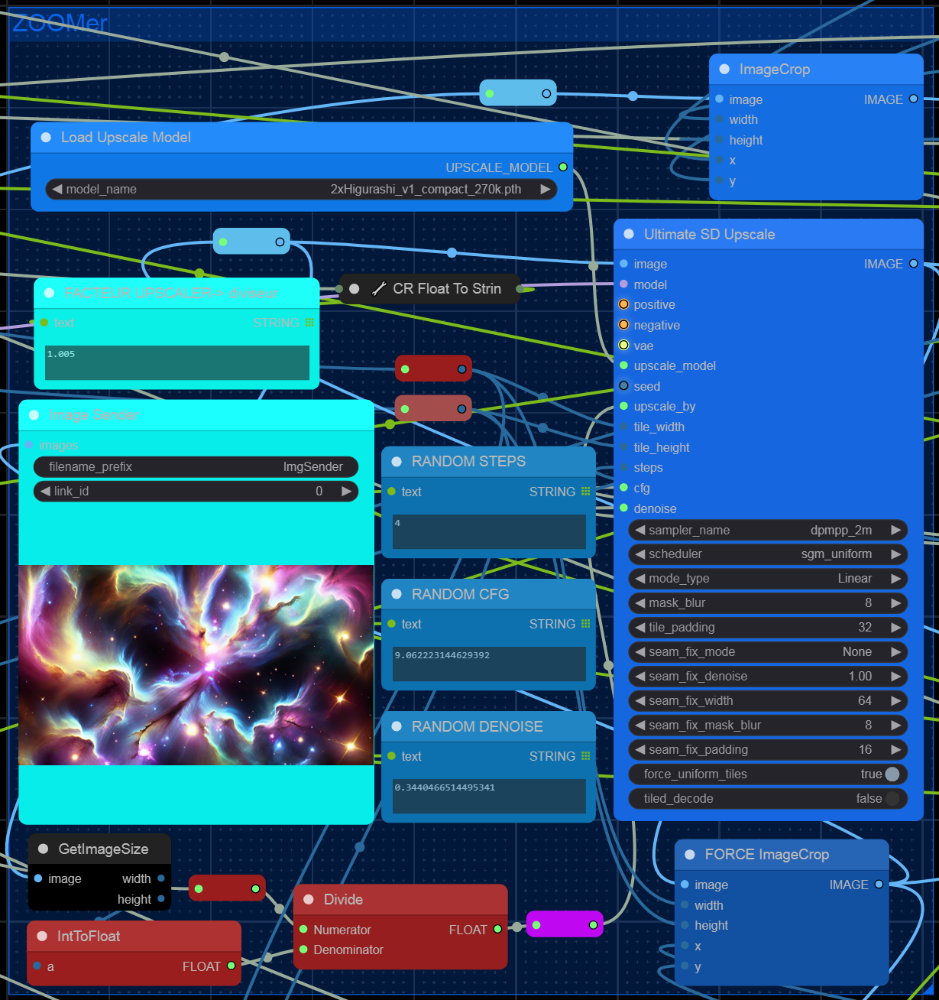 
Modele d'Upscale par defaur <b> 2xHigurashi_V1_compact_270k</b> est rapide et efficace 
Par defaut : <b>SAMPLER</b> : dpmpp_2 -- <b>Scheduleur</b> : sgm_uniform 
Les autres options sont a discretion 

### C1 ) Controles de l'image + redimensionnement 
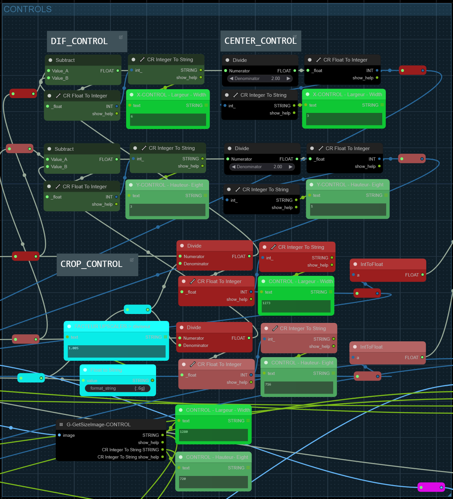 
Ce sont des controles de la taille de l'image et du crop pour le zoom 
These are image size and crop controls for zooming 

### RZ ) Zoom Random Step / cfg pour creer de l'aleatoire 
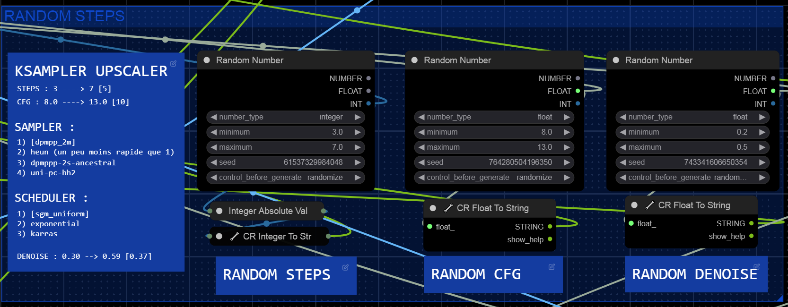 
Permet de cadrer - Restrict step / cfg 
Step entre - Between { 3 ; 7 } -- cfg entre - Between{8.0 ; 13.0 } 

### MATH/TRIGO ) Effectue la rotation de l'image en respectant le ratio d'origine -- Rotates the image respecting the original ratio 
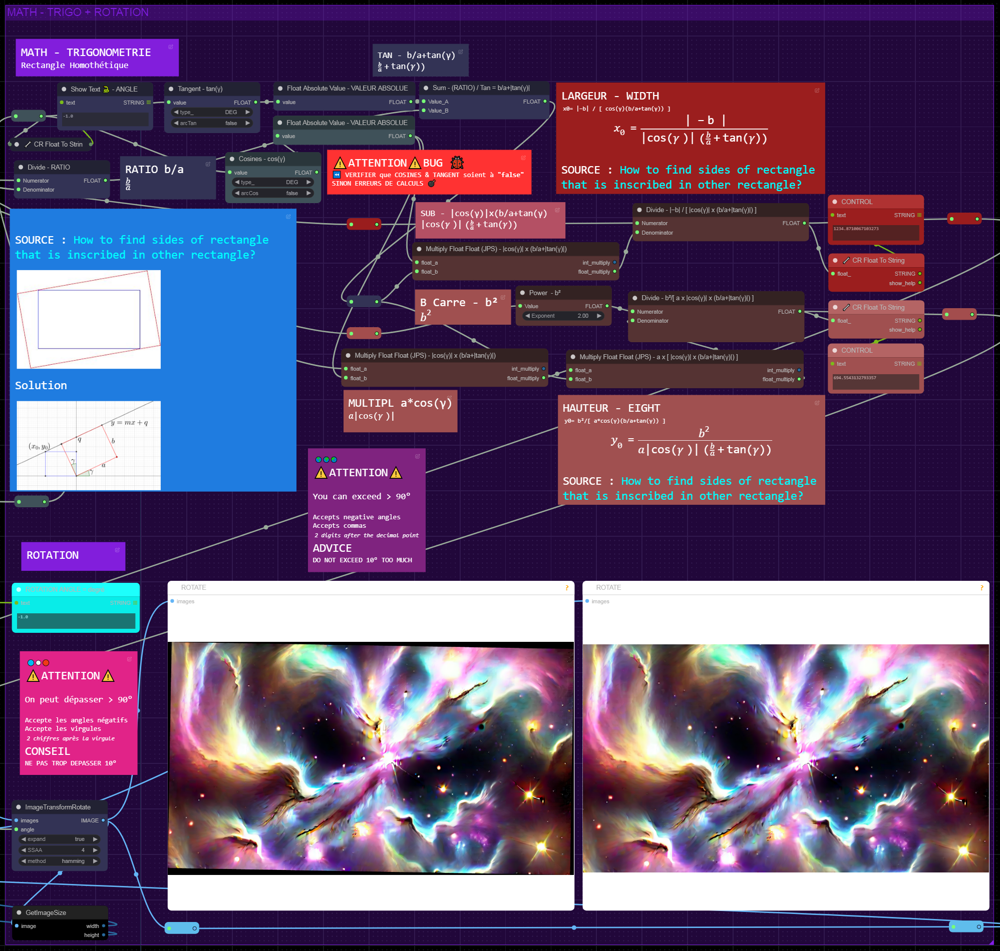 
🔵⚪️🔴 C'est la partie dans laquelle l'image subi une rotation et conserve ses proportions initiales 
Ne pas depasser +/-10° d'angle sinon la rotation est trop brutale 
🌎🌍🌏 This is the part in which the image is rotated and keeps its initial proportions 
Do not exceed +/-10° angle otherwise the rotation is too abrupt 
<h2>ℹ️ SOURCE : <a href="https://math.stackexchange.com/questions/3181876/how-to-find-sides-of-rectangle-that-is-inscribed-in-other-rectangle">How to find sides of rectangle  that is inscribed in other rectangle ?</a></h2>

### C2 ) Controles de l'image Finale 
 
Controle la taille de l'image finale par rapport aux dimension initialement renseignees 4) Taille de l'image L/H

### CR ) Controle et Forcage de la taille de l'image 
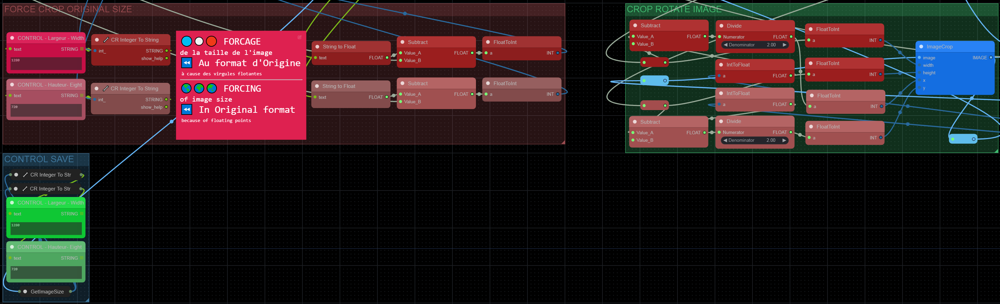 
🔵⚪️🔴 A cause des virgules flotantes parfois la taille de l'image peut varier donc on : 
Controle et force le redimensionnement de l'image aux dimensions initiales 4) Taille de l'image L/H 
🌎🌍🌏 Due to floating points sometimes the image size can vary so we: 
Control and force the image to be resized to the initial dimensions 4) Image size W/H 

### S ) Sauvegarde de l'image et options 
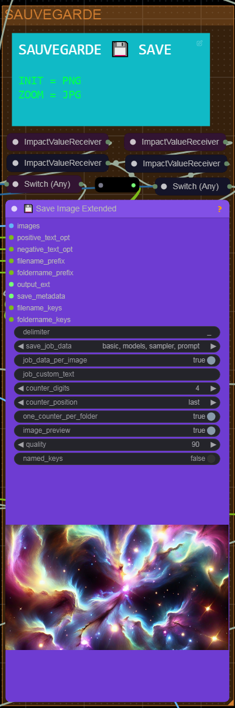 
🔵⚪️🔴  La sauvegarde de l'image et ses options 
Permet de sauvegarder un fichier "txt" dans lequel il y a des metadata 
L'image "initiale" est sauvee en PNG avec le prompt / workflow embarque 
Le nom de l'image initiale PNG est : <b>"INITIAL+TEST_'<i>FICHIER</i>'.png"</b> 
Les images de Zoom sont automatiquement permutees en JPG 
Le nom de l'image zoom JPG est : <b>"ZOOM_'<i>FICHIER</i>'.jpg"</b> 

🌎🌍🌏 Saving the image and its options 
Allows you to save a "txt" file in which there is metadata 
The "initial" image is saved in PNG with the embedded prompt / workflow 
The name of the initial PNG image is:<b>"INITIAL+TEST_'<i>FICHIER</i>'.png"</b> 
Zoom images are automatically switched to JPG 
The name of the JPG zoom image is: <b>"ZOOM_'<i>FICHIER</i>'.jpg"</b>br>

### ℹ️ <u>VOIR GIT-UB / FOLLOW GIT-HUB</u> : [save-image-extended-comfyui](https://github.com/audioscavenger/save-image-extended-comfyui) 

### COMPTEUR ) Compte le nombre d'images generees pour le zoom - Counts the number of images generated for zooming 
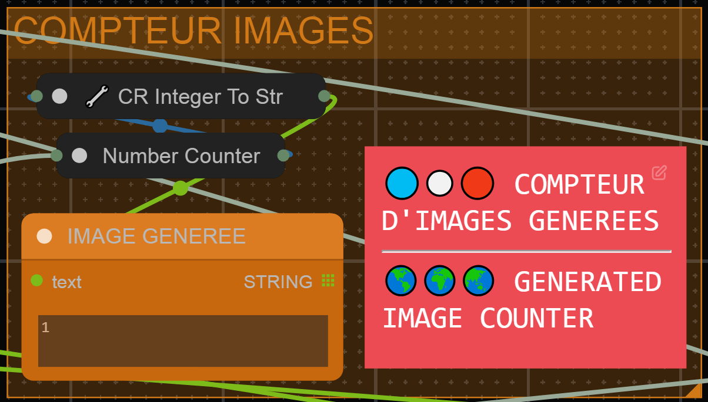 
Fait ce qui est indique 
Do what is instructed 

-----
-----

<h1>D - In Fine</h1>

## Liens Utiles - Links usefull :
VIEILLES VERSIONS / OLDS VERSION  <b>COMFYui</b> :
https://github.com/comfyanonymous/ComfyUI/tags 
INDISPENSABLE : <b>COMFYui Manger</b> : https://github.com/ltdrdata/ComfyUI-Manager

### Beginner’s Guide to ComfyUI
By Andrew : https://stable-diffusion-art.com/comfyui/
### Unlock the Power of ComfyUI: A Beginner's Guide with Hands-On Practice
And "RUN WORKFLOW" online : https://www.runcomfy.com/tutorials/comfyui-beginners-guide
### ComfyUI WIKI
Your Ultimate Companion for Mastering Stable Diffusion ComfyUI : https://comfyui-wiki.com

----
### Credit
ComfyUI/[ComfyUI](https://github.com/comfyanonymous/ComfyUI) - A powerful and modular stable diffusion GUI.

**And, for all ComfyUI custom node developers**

🙏 Un grand merci au / Special Thanks to the  : <b>GOAT [ltdrdata](https://github.com/ltdrdata)</b> 
[ComfyUI ltdrdata:FORK](https://github.com/comfyanonymous/ComfyUI) 
[ComfyUI-Manager](https://github.com/ltdrdata/ComfyUI-Manager) 
[ComfyUI-Impact-Pack](https://github.com/ltdrdata/ComfyUI-Impact-Pack) 
[ComfyUI-Inspire-Pack](https://github.com/ltdrdata/ComfyUI-Inspire-Pack) 
[ComfyUI-extension-tutorials](https://github.com/ltdrdata/ComfyUI-extension-tutorials)

----
----

###  Dfalm.<i>[Licence ](https://github.com/Dfalm-Original/COMFYui?tab=License-1-ov-file)</i>

 github : <a href="https://github.com/Dfalm-Original/COMFYui" target="_blank">https://github.com/Dfalm-Original/COMFYui</a>

 Youtube : <a href="https://www.youtube.com/@Dfalm" target="_blank">https://www.youtube.com/@Dfalm</a>
