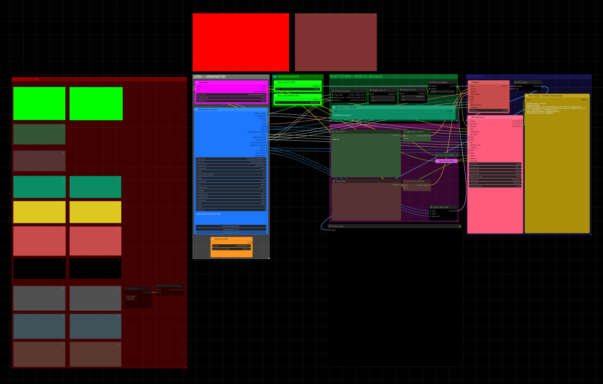
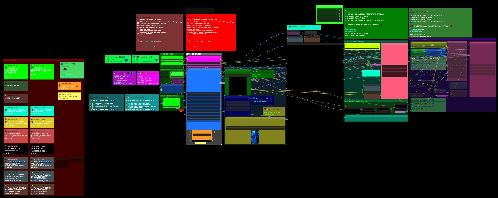
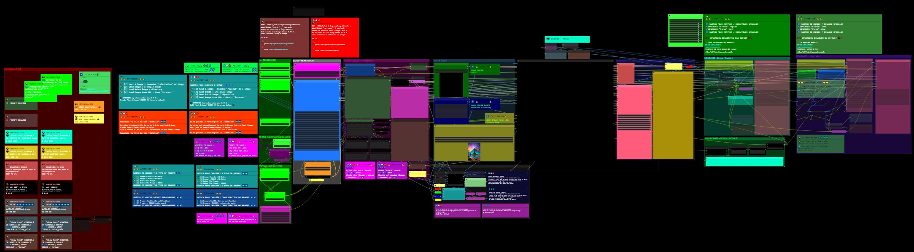
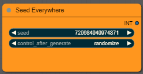
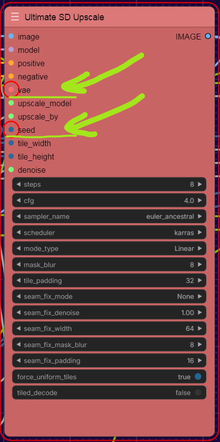
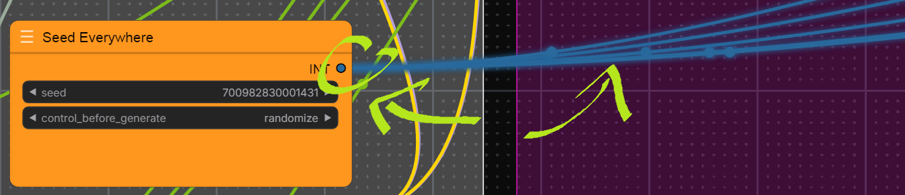
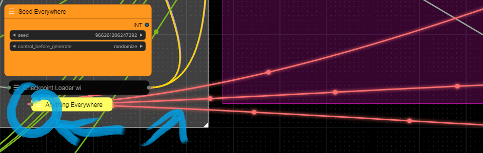

###  Dfalm.<i>[Licence ](https://github.com/Dfalm-Original/COMFYui?tab=License-1-ov-file)</i>
# **-- WorkFlows --** 🚧🚧 WORK IN PROGRESS 🚧🚧

#### A - Normalisation B - WorkFlows C - Misc D - In Fine
----
## INTRODUCTION
Dans ce chaptire je vais mettre en place une "norme" commune : **Normalisation** pour les différents éléments 
Le premier élément est la Langue 
Pour distinguer le Français de l'Anglais je vais utiliser les icones suivantes : 
🔵⚪️🔴 En Français 
🌎🌍🌏 In English

Autre exemple trivial pour le Prompt Positif je vais utiliser la couleur "vert" et pour le prompt négatif la couleur "rouge" 
Couleur par défaut proposée par COMFYui 
Lorsque ces couleurs sont spécifiques je le préciserais avec le code couleurs

---
In this chapter I will set up a common "standard" aka **Normalisation** for the different elements 
The first element is the Language 
To distinguish French from English I will use the following icons: 
🔵⚪️🔴 In French 
🌎🌍🌏 In English 

Another trivial example for the Positive Prompt I will use the color "green" and for the negative prompt the color "red" 
Default color proposed by COMFYui 
When these colors are specific I will specify it with the color code

---
## A - Normalisation
VOIR LA PAGE AD HOC :  [README ](https://github.com/Dfalm-Original/COMFYui)
 
REFER TO AD HOC PAGE: [README ](https://github.com/Dfalm-Original/COMFYui)

-----
-----

## B - WorkFlow
🔵⚪️🔴 Dans ce chapitre je propose des WorkFlow, les liens des exemples, des images et autres... 🌎🌍🌏 In this chapter I propose WorkFlow, links to examples, images and others...

0) Basic
#### BASIC-V1.00
 
🔵⚪️🔴  Remplace le workflow **"default"**   🌎🌍🌏 Replaces **"default"** workflow 
 

### Differents elements / Elements & Nodes 
### 🔵⚪️🔴 Tous les elements communs aux workflow  🌎🌍🌏 Commons elements from differents workflow
- i) Nom du fichier💗 / Nom du repertoire💜 -- File name💗 / Path💜   
 
- ii) Reglages / Settings  
 

1 - Lora 
2 - CheckPoint 
3 - **No-VAE** - la VAE n'est pas exploitee ici = Aucune influence / inutile de la renseigner 
4 - Modele SD / SDXL   
 
5 - **No-Seed** la seed est exploitee plus bas **9️⃣** = Aucune influence / inutile de la renseigner Seed is exploited below **9️⃣** = No influence / no need to setup up it 
6 - Parametrages 'classiques' d'un Ksampler / 'Classic' parameters of a Ksampler: **steps + cfg + sampler + scheduler** ... 
7 - Largeur-Hauteur / Width-Eight 
8 - Batch Size 
9 - Seed **9️⃣** "**EveryWhere**" 

- iii) Prompts 
 
Vert = Positif / Green = Positive -- Rouge = Negatif / Red = Negative 

- iv) Control 
 
Controle le nom du fichier / Check the file name : **Nom-Fichier+Checkpoint**

- v) Sauvegarde Type de fichier & metadata - Save File type & metadata 
 
💙Permet de sauvegarder les metadatas dans un fichier "txt" externe 
💙Allows you to save metadata in an external "txt" file 
💚Permet de sauvegarder en PNG - JPG - JPEG - WEBP   💚Allows you to save in PNG - JPG - JPEG - WEBP  

- vi) Preview image 
 
🗃 Noir / Black

### 🔵⚪️🔴 Tous ces elements sont communs aux differents workflows   
### 🌎🌍🌏 All these elements are common to the different workflows

I) WorkFlows par defaut :

#### -A-  DEFAUT_MODEL-A_Text-2-Img+UPscalersV1.00
 

🔵⚪️🔴 Permet de faire image-to-image avec des options de *prompts* et la possibilité d'*UPScaler* l'image rendue  - Par defaut les deux UPscalers sont désactivés  
## - U1💚/U2💜

Le premier Upscaler **U1💚** est un Upscaler "simple" qui agrandit l'image sans post-traitement 
Le second Upscaler **U2💜** est un 'refiner' il utilise un Ksampler, la seed, la VAE ...

## - **🧡ON/OFF**
L'interrupteur note **🧡ON/OFF** permet d'activer / desactiver les groupes :  U1💚/U2💜 en fonction des besoin d'UPScale

## - **⚪️L** (Lora)
L'option **⚪️L** permet d'ajouter un Lora lors de la generation de l'images - Par defaut l'option est desactivee 

## - Sauvegarde / Save  
Sauvegarde / Save **🔴S** Ref : *0️⃣BASIC-V1.00

## **🔘P** (Prompt)
Prompt **🔘P** 
Il y a une option "Prompt" Classique / Batch & Vanille / Ameliore"  
Permet de choisir 4 Options 
1 Prompt Classique 'Vanille' 
2 Prompt Classique + Bonus = amélioré par une série de mots --**💗P**-- 
3 Prompt Fichier "Batch" 
-> *1 Ligne = 1 Prompt* 
4 Prompt Fichier "Batch" + Bonus = amélioré par une série de mots --**💗P**-- 
 -> *1 Ligne = 1 Prompt* + "Bonus amélioré" 

#### - Pour les UPScaler voir le chapitre idoine : <u>4️⃣ Upscalers </u>

#### -B- DEFAUT_MODEL-B_Load-ImgZ+UPscalersV1.00

Permet d'Upscaler des images

#### - C - DEFAUT_Text-2-Img+UPscalersV1.1.3-Valerie

IV) Upscalers :
### Hires - Lent / Slow  
#### -- Desactive par defaut // Disabled by default

#### 🔵⚪️🔴  Modifier le coeeficient multiplicateur  
-Par défaut (3)  
-- Choisir le model "Upscaler" 
#### ℹ️ Le coefficient multiplicateur est indépendant du choix du modele upscaler 
<u>EXEMPLE</u> : On peut utiliser le modele **8x** *_NMKD-Superscale_150000_G* avec un coefficient de **3**  
Inversement on peut utiliser un coefficient de 4 avec le modele **2x***Higurashi_v1_compact_270k* 

Il est préférable que le coefficient multiplicateur soit inferieur a celui du modele   
On peut utiliser de cette manière des coefficient impair 

J'ai choisi arbitrairement d'utiliser des coefficients entiers : la primitive "MULTIPLICATEUR" ne permet pas les nombres a virgule ( Libre a vous de le modifier - La Dfalm.<i>[Licence ](https://github.com/Dfalm-Original/COMFYui?tab=License-1-ov-file)</i> le permet ) 

## 📥 Telecharger des modeles / download models :
 [OPEN UPSCALER](https://openmodeldb.info) : https://openmodeldb.info

#### INSTALLER LES MODELES DANS / INSTALL MODELS IN

.\ComfyUI\Models\upscale_models

----
----

## C - Misc
Divers à déterminer

Ce **README** est une simple présentation 
( *Plus de détails dans un fichier spécifique* )

-----
-----

<h1 id="attention"> A - NORMALISATION  🗃️ </h1>

## Permier / First :  Langue / Language
<h1>🔵⚪️🔴 En Français</h1>
<h1>🌎🌍🌏 In English</h1>

----
- ## PREVIEW
A Gauche 🔵⚪️🔴 En Français // In Right 🌎🌍🌏 In English 
In Left 🔵⚪️🔴 In French // A Droite 🌎🌍🌏 En Anglais
 
[ CLICK TO DOWNLOAD PNG WORKFLOW ] 

----

----

<h1>B - WORKFLOW</h1>
Coming soon...

----

<h1>C - MISC</h1>

### Conseil / Advice
🔵⚪️🔴 Pour la preview image j'utilise egalement la couleur noire et uniquement "PREVIEW IMAGE" 
Je conseille d'utiliser les "SD" Prompt generator et Prompt Saver 1️⃣ pour diverses raisons

🌎🌍🌏 For the preview image I also use black color and only "PREVIEW IMAGE" 
I recommend using the "SD" Prompt generator and Prompt Saver 1️⃣ for various reasons

### BUGS imprevu / unexpected
🔵⚪️🔴 Pour une raison non determinee il semble y avoir des problemes de performances avec "SD Parameter Generator" 1️⃣ 
Une astuce consiste a ne pas utiliser la "seed" du noeud, j'utilise (de preference) "Seed Everywhere" 2️⃣

🌎🌍🌏 For some reason there seems to be performance issues with "SD Parameter Generator" 1️⃣ 
A tip is to not use the node "seed". I use (preferably) "Seed Everywhere" 2️⃣ 
 
Couleur / Color : 255 - 150 - 30 

1️⃣ SD Prompt Reader Node : https://github.com/receyuki/comfyui-prompt-reader-node 
2️⃣ cg-use-everywhere : https://github.com/chrisgoringe/cg-use-everywhere

# BUG
🔵⚪️🔴  <u>Bug trivial</u> : parfois la VAE ou la Seed ou les deux sont "déconnectées" 
Le noeud "Everywhere" 2️⃣ ne transmet pas la VAE/seed

🌎🌍🌏 <u>Trivial bug</u>: sometimes VAE or Seed or both are "disconnected" 
The "Everywhere" node 2️⃣ does not transmit VAE/seed

## RESOLUTION : 🔵⚪️🔴  / 🌎🌍🌏
### [F5] rafraichissement du navigateur [F5] browser refresh

Puis vérifier que les liens sont actifs / Then check that the links are active :
 

 

2️⃣ cg-use-everywhere : https://github.com/chrisgoringe/cg-use-everywhere

---
<h1>D - In Fine</h1>

## Liens Utiles - Links usefull :
VIEILLES VERSIONS / OLDS VERSION  <b>COMFYui</b> :
https://github.com/comfyanonymous/ComfyUI/tags 
INDISPENSABLE : <b>COMFYui Manger</b> : https://github.com/ltdrdata/ComfyUI-Manager

### Beginner’s Guide to ComfyUI
By Andrew : https://stable-diffusion-art.com/comfyui/
### Unlock the Power of ComfyUI: A Beginner's Guide with Hands-On Practice
And "RUN WORKFLOW" online : https://www.runcomfy.com/tutorials/comfyui-beginners-guide
### ComfyUI WIKI
Your Ultimate Companion for Mastering Stable Diffusion ComfyUI : https://comfyui-wiki.com

----
### Credit
ComfyUI/[ComfyUI](https://github.com/comfyanonymous/ComfyUI) - A powerful and modular stable diffusion GUI.

**And, for all ComfyUI custom node developers**

🙏 Un grand merci au / Special Thanks to the  : <b>GOAT [ltdrdata](https://github.com/ltdrdata)</b> 
[ComfyUI ltdrdata:FORK](https://github.com/comfyanonymous/ComfyUI) 
[ComfyUI-Manager](https://github.com/ltdrdata/ComfyUI-Manager) 
[ComfyUI-Impact-Pack](https://github.com/ltdrdata/ComfyUI-Impact-Pack) 
[ComfyUI-Inspire-Pack](https://github.com/ltdrdata/ComfyUI-Inspire-Pack) 
[ComfyUI-extension-tutorials](https://github.com/ltdrdata/ComfyUI-extension-tutorials)

----
----
###  Dfalm.<i>[Licence ](https://github.com/Dfalm-Original/COMFYui?tab=License-1-ov-file)</i>

 github : <a href="https://github.com/Dfalm-Original/COMFYui" target="_blank">https://github.com/Dfalm-Original/COMFYui</a>

 Youtube : <a href="https://www.youtube.com/@Dfalm" target="_blank">https://www.youtube.com/@Dfalm</a>

