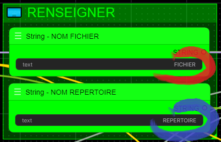
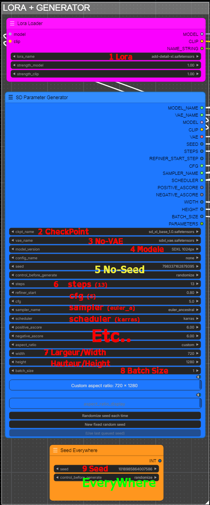
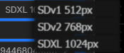
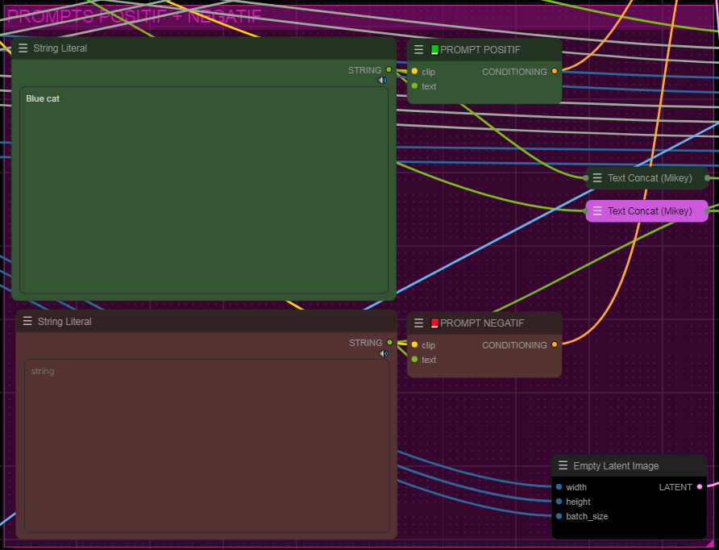
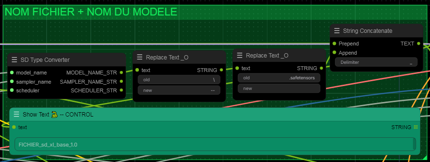
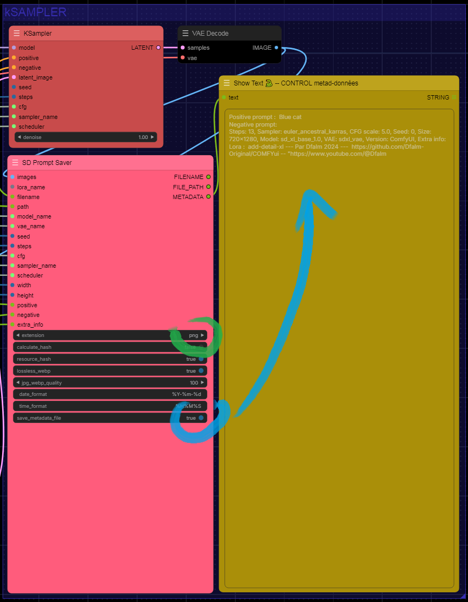
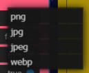
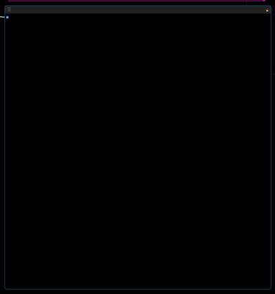
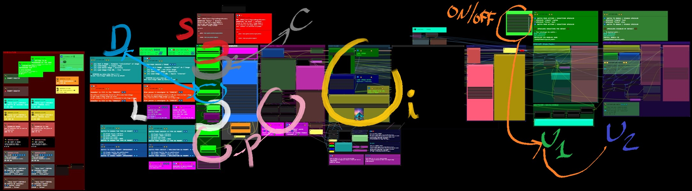
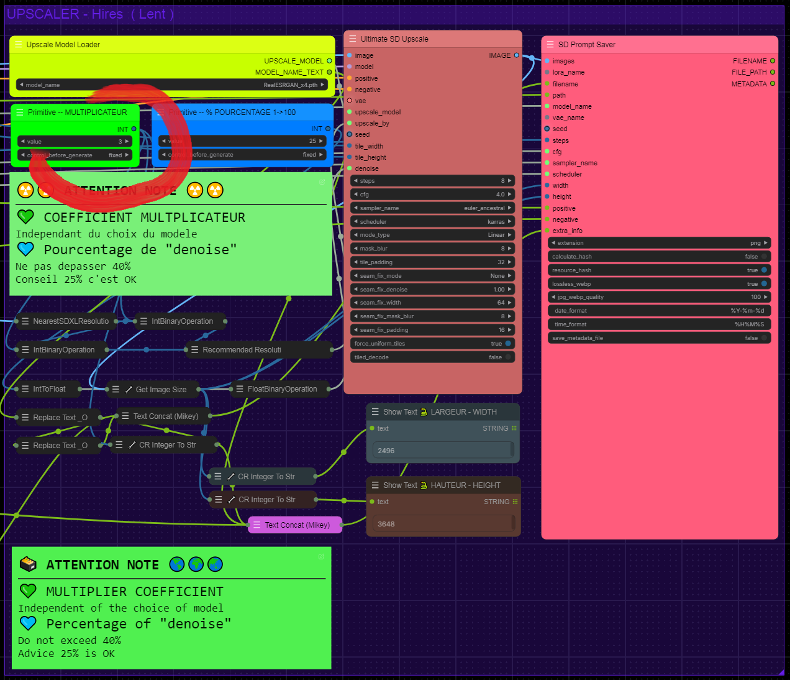

###  Dfalm.<i>[Licence ](https://github.com/Dfalm-Original/COMFYui?tab=License-1-ov-file)</i>
# **-- WorkFlows --** 🚧🚧 WORK IN PROGRESS 🚧🚧

#### A - Normalisation B - WorkFlows C - Misc D - In Fine
----
## INTRODUCTION
Rappel de la "norme" commune : **Normalisation** pour les différents éléments 
Le premier élément est la Langue 
Pour distinguer le Français de l'Anglais je vais utiliser les icones suivantes : 
🔵⚪️🔴 En Français 
🌎🌍🌏 En Anglais

Autre exemple trivial pour le Prompt Positif je vais utiliser la couleur "vert" et pour le prompt négatif la couleur "rouge" 
Couleur par défaut proposée par COMFYui 
Lorsque ces couleurs sont spécifiques je le préciserais avec le code couleurs

---
Reminder of the common "standard" aka **Normalisation** for the different elements 
The first element is the Language 
To distinguish French from English I will use the following icons: 
🔵⚪️🔴 In French 
🌎🌍🌏 In English 

Another trivial example for the Positive Prompt I will use the color "green" and for the negative prompt the color "red" 
Default color proposed by COMFYui 
When these colors are specific I will specify it with the color code

---
## A - Normalisation
#### VOIR LA PAGE AD HOC :  [ <u>README</u> ](https://github.com/Dfalm-Original/COMFYui) REFER TO AD HOC PAGE: [ <u>README</u> ](https://github.com/Dfalm-Original/COMFYui)

-----
-----

## B - WorkFlows
🔵⚪️🔴 Dans ce chapitre je propose des WorkFlow, les liens des exemples, des images et autres... 🌎🌍🌏 In this chapter I propose WorkFlow, links to examples, images and others...

## 0) BASIC-V1.00
 
🔵⚪️🔴  Remplace le workflow **"default"**   🌎🌍🌏 Replaces **"default"** workflow 
 

### Differents elements / Elements & Nodes 
### 🔵⚪️🔴 Tous les elements communs aux workflow  🌎🌍🌏 Commons elements from differents workflow
- i) Nom du fichier💗 / Nom du repertoire💜 -- File name💗 / Path💜   
 
- ii) Reglages / Settings  
 

1 - Lora 
2 - CheckPoint 
3 - **No-VAE** - la VAE n'est pas exploitee ici = Aucune influence / inutile de la renseigner 
4 - Modele SD / SDXL   
 
5 - **No-Seed** la seed est exploitee plus bas **9️⃣** = Aucune influence / inutile de la renseigner Seed is exploited below **9️⃣** = No influence / no need to setup up it 
6 - Parametrages 'classiques' d'un Ksampler / 'Classic' parameters of a Ksampler: **steps + cfg + sampler + scheduler** ... 
7 - Largeur-Hauteur / Width-Eight 
8 - Batch Size 
9 - Seed **9️⃣** "**EveryWhere**" 

- iii) Prompts 
 
Vert = Positif / Green = Positive -- Rouge = Negatif / Red = Negative 

- iv) Control 
 
Controle le nom du fichier / Check the file name : **Nom-Fichier+Checkpoint**

- v) Sauvegarde Type de fichier & metadata - Save File type & metadata 
 
💙Permet de sauvegarder les metadatas dans un fichier "txt" externe 
💙Allows you to save metadata in an external "txt" file 
💚Permet de sauvegarder en PNG - JPG - JPEG - WEBP   💚Allows you to save in PNG - JPG - JPEG - WEBP  

- vi) Preview image 
 
🗃 Noir / Black

### 🔵⚪️🔴 Tous ces elements sont communs aux differents workflows   
### 🌎🌍🌏 All these elements are common to the different workflows

## I) -A-  DEFAUT_MODEL-A_Text-2-Img+UPscalersV1.00
 

#### 🔵⚪️🔴 Permet de faire image-to-image avec des options de *prompts* et la possibilité d'*UPScaler* l'image rendue  - Par defaut les deux UPscalers sont désactivés ❌  
## - U1💚/U2💜 - Upscalers ( desactives par defaut )

Le premier Upscaler **U1💚** est un Upscaler "simple" qui agrandit l'image sans post-traitement 
Le second Upscaler **U2💜** est un 'refiner' il utilise un Ksampler, la seed, la VAE ...

## - **🧡ON/OFF**
L'interrupteur note **🧡ON/OFF** permet d'activer / desactiver les groupes :  U1💚/U2💜 en fonction des besoin d'UPScale

## - **⚪️L** (Lora)
L'option **⚪️L** permet d'ajouter un Lora lors de la generation de l'images - Par defaut l'option est desactivee 

## - **🔴S** Sauvegarde / Save  
Sauvegarde / Save **🔴S** Ref : *0️⃣BASIC-V1.00

## **🔘P** (Prompt)
Prompt **🔘P** 
Il y a une option "Prompt" Classique / Batch & Vanille / Ameliore"  
Permet de choisir 4 Options 
1 Prompt Classique 'Vanille' 
2 Prompt Classique + Bonus = amélioré par une série de mots --**💗P**-- 
3 Prompt Fichier "Batch" 
-> *1 Ligne = 1 Prompt* 
4 Prompt Fichier "Batch" + Bonus = amélioré par une série de mots --**💗P**-- 
 -> *1 Ligne = 1 Prompt* + "Bonus amélioré" 

#### 🌎🌍🌏 Allows you to do image-to-image with *prompts* options and the ability to *UPScaler* the rendered image  - By default both UPscalers are disabled ❌  
## - U1💚/U2💜 - Upscalers (disabled by default)

The first Upscaler **U1💚** is a "simple" Upscaler that enlarges the image without post-processing 
The second Upscaler **U2💜** is a 'refiner' it uses a Ksampler, the seed, the VAE ...

## - **🧡ON/OFF**
The switch note **🧡ON/OFF** allows you to activate / deactivate the groups: U1💚/U2💜 depending on the UPScale needs

## - **⚪️L** (Lora)
The **⚪️L** option allows you to add a Lora when generating the images - By default the option is disabled 

## - **🔴S** Save / Save
Save / Save **🔴S** Ref: *0️⃣BASIC-V1.00

## **🔘P** (Prompt)
Prompt **🔘P** 
There is a "Prompt" option Classic / Batch & Vanilla / Improved"
Allows you to choose 4 Options 
1 Prompt Classic 'Vanilla' 
2 Prompt Classic + Bonus = improved by a series of words --**💗P**-- 
3 Prompt File "Batch" 
-> *1 Line = 1 Prompt* 
4 Prompt File "Batch" + Bonus = enhanced by a series of words --**💗P**-- 
-> *1 Line = 1 Prompt* + "Enhanced Bonus" 

## - Pour les UPScaler voir le chapitre idoine : <u>4️⃣ Upscalers </u>

## II) -B- DEFAUT_MODEL-B_Load-ImgZ+UPscalersV1.00
 

#### 🔵⚪️🔴 Permet d'Upscaler des images avec 2 Upscalers - Par defaut l'UPscaler "Hires/Lent" U2💜 est désactivé ❌  

## - U1💚/U2💜 - Upscalers
Le premier Upscaler **U1💚** est un Upscaler "simple" qui agrandit l'image sans post-traitement 
Le second Upscaler **U2💜** est un 'refiner' il utilise un Ksampler, la seed, la VAE ...  Desactive par defaut

## - **💛i** (Load-s Images)
L'option **💛i** permet de choisir entre différentes options d'images : Load Images 
 
💚 - La première option est l'option '**classic**' lecture / load image simple : 1 image 
💙 - La deuxième option est '**load image batch**' permet de prendre toutes les images d'un repertoire 
💛 - La troisieme option est '**load image from URL**' permet d'utiliser une images 'direct' depuis l'adresse Web sans avoir besoin de la telecharger pour l'utiliser dans l'option [1] - 💚 

### Toutes les Options restent comnunes :
#### - **🧡ON/OFF**
#### - **⚪️L** (Lora)
#### - **🔘P** (Prompt)
#### - **🔴S** Sauvegarde / Save 

#### 🌎🌍🌏 Allows you to Upscale images with 2 Upscalers - By default the "Hires/Lent" U2💜 UPscaler is disabled ❌  

## - U1💚/U2💜 - Upscalers
The first Upscaler **U1💚** is a "simple" Upscaler that enlarges the image without post-processing 
The second Upscaler **U2💜** is a 'refiner' it uses a Ksampler, the seed, the VAE ...  Disabled by default

## - **💛i** (Load-s Images)
The **💛i** option allows you to choose between different image options: Load Images 
 
💚 - The first option is the '**classic**' option, read / load single image: 1 image 
💙 - The second option is '**load image batch**', allows you to take all the images from a directory 
💛 - The third option is '**load image from URL**', allows you to use an image 'direct' from the web address without having to download it to use it in option [1] - 💚 

### All Options remain common:
#### - **🧡ON/OFF**
#### - **⚪️L** (Lora)
#### - **🔘P** (Prompt)
#### - **🔴S** Save

## - Pour les UPScaler voir le chapitre idoine : <u>4️⃣ Upscalers </u>

## III) - C - DEFAUT_Text-2-Img+UPscalersV1.1.3-Valerie

#### 🔵⚪️🔴 Combine le Modele A et le Modele B 
A - Permet de faire image-to-image avec des options de *prompts*  
### Toutes les Options restent comnunes :
#### - **🧡ON/OFF**
#### - **⚪️L** (Lora)
#### - **🔘P** (Prompt)
#### - **🔴S** Sauvegarde / Save    
#### - **💛i** (Load-s Images)

## - **⚫️C** Choix de generation d'image
Choisir entre 4 options :
- [1] <b>text 2 image </b> -  Ksampler "calcul" de l'image  
- [2]  <b>Load-Image </b>: une seule image  
- [3]  <b>Load Batch image </b> / répertoire   
- [4]  <b>Load Image From URL </b>: depuis 'internet'  

## - **💙 D** Denoise
Permet de modifier le '**denoise**' pour les options 2 3 et 4<b> ( *Load-Image - Load Batch image - Load Image From URL* )
Le '**denoise**' est force a **1** pour l'option **[1]**

## - U1💚/U2💜 - Upscalers ( desactives par defaut )
Le premier Upscaler **U1💚** est un Upscaler "simple" qui agrandit l'image sans post-traitement 
Le second Upscaler **U2💜** est un 'refiner' il utilise un Ksampler, la seed, la VAE ... 

## - **🧡ON/OFF**
L'interrupteur note **🧡ON/OFF** permet d'activer / desactiver les groupes :  U1💚/U2💜 en fonction des besoin d'UPScale

## - **⚪️L** (Lora)
L'option **⚪️L** permet d'ajouter un Lora lors de la generation de l'images - Par defaut l'option est desactivee 

## - Sauvegarde / Save  
Sauvegarde / Save **🔴S** Ref : *0️⃣BASIC-V1.00

## - **💛i** (Load-s Images)
L'option **💛i** permet de choisir entre différentes options d'images : Load Images 
 
💚 - La première option est l'option '**classic**' lecture / load image simple : 1 image 
💙 - La deuxième option est '**load image batch**' permet de prendre toutes les images d'un repertoire 
💛 - La troisieme option est '**load image from URL**' permet d'utiliser une images 'direct' depuis l'adresse Web sans avoir besoin de la telecharger pour l'utiliser dans l'option [1] - 💚 

#### 🌎🌍🌏 Combine Model A and Model B 
A - Allows image-to-image with *prompts* options  
### All Options remain common:
#### - **🧡ON/OFF**
#### - **⚪️L** (Lora)
#### - **🔘P** (Prompt)
#### - **🔴S** Sauvegarde / Save
#### - **💛i** (Load-s Images)

## - **⚫️C** Image generation choice
Choose between 4 options:
- [1] <b>text 2 image</b> - Ksampler "calculation" of the image  
- [2] <b>Load-Image</b>: a single image  
- [3] <b>Load Batch image</b> / directory  
- [4] <b>Load Image From URL</b>: from 'internet'  

## - **💙 D** Denoise
Allows to modify the '**denoise**' for options 2 3 and 4<b> ( *Load-Image - Load Batch image - Load Image From URL* )
The '**denoise**' is forced to **1** for option **[1]**

## - U1💚/U2💜 - Upscalers ( disabled by default )
The first Upscaler **U1💚** is a "simple" Upscaler that enlarges the image without post-processing 
The second Upscaler **U2💜** is a 'refiner' it uses a Ksampler, the seed, the VAE ... 

## - **🧡ON/OFF**
The switch notes **🧡ON/OFF** allows you to activate/deactivate the groups: U1💚/U2💜 depending on UPScale's needs

## - **⚪️L** (Lora)
The **⚪️L** option allows you to add a Lora when generating the images - By default the option is disabled 

## - Save / Save
Save / Save **🔴S** Ref: *0️⃣BASIC-V1.00

## - **💛i** (Load-s Images)
The **💛i** option allows you to choose between different image options: Load Images 
 
💚 - The first option is the '**classic**' option, read / load simple image : 1 image 
💙 - The second option is '**load image batch**' allows you to take all the images from a directory 
💛 - The third option is '**load image from URL**' allows you to use an image 'direct' from the web address without having to download it to use it in option [1] - 💚 

## - Pour les UPScaler voir le chapitre idoine : <u>4️⃣ Upscalers </u>

## IV) Upscalers 4️⃣:
### Hires - Lent / Slow  
#### -- Desactive par defaut // Disabled by default

#### 🔵⚪️🔴  Modifier le coeeficient multiplicateur  
-Par défaut (3)  
-- Choisir le model "Upscaler" 
#### ℹ️ Le coefficient multiplicateur est indépendant du choix du modele upscaler 
<u>EXEMPLE</u> : On peut utiliser le modele **8x** *_NMKD-Superscale_150000_G* avec un coefficient de **3**  
Inversement on peut utiliser un coefficient de 4 avec le modele **2x***Higurashi_v1_compact_270k* 

Il est préférable que le coefficient multiplicateur soit inferieur a celui du modele   
On peut utiliser de cette manière des coefficient impair 

J'ai choisi arbitrairement d'utiliser des coefficients entiers : la primitive "MULTIPLICATEUR" ne permet pas les nombres a virgule ( Libre a vous de le modifier - La Dfalm.<i>[Licence ](https://github.com/Dfalm-Original/COMFYui?tab=License-1-ov-file)</i> le permet ) 

#### 🌎🌍🌏 Modify the multiplier coefficient  
-By default (3) 
-- Choose the "Upscaler" model 
#### ℹ️ The multiplier coefficient is independent of the choice of the upscaler model 
<u>EXAMPLE</u>: We can use the model **8x** *_NMKD-Superscale_150000_G* with a coefficient of **3**  
Conversely, we can use a coefficient of 4 with the model **2x***Higurashi_v1_compact_270k* 

It is preferable that the multiplier coefficient is lower than that of the model 
We can use odd coefficients in this way 

I arbitrarily chose to use integer coefficients: the primitive "MULTIPLIER" does not allow numbers with a comma (You are free to modify it - The Dfalm.<i>[License ](https://github.com/Dfalm-Original/COMFYui?tab=License-1-ov-file)</i> allows it ) 

## 📥 Telecharger des modeles / download models :
 [OPEN UPSCALER](https://openmodeldb.info) : https://openmodeldb.info

#### INSTALLER LES MODELES DANS / INSTALL MODELS IN

.\ComfyUI\Models\upscale_models

-----
-----

<h1>C - MISC</h1>

### Conseil / Advice
🔵⚪️🔴 Pour la preview image j'utilise egalement la couleur noire et uniquement "PREVIEW IMAGE" 
Je conseille d'utiliser les "SD" Prompt generator et Prompt Saver 1️⃣ pour diverses raisons

🌎🌍🌏 For the preview image I also use black color and only "PREVIEW IMAGE" 
I recommend using the "SD" Prompt generator and Prompt Saver 1️⃣ for various reasons

1️⃣ SD Prompt Reader Node : https://github.com/receyuki/comfyui-prompt-reader-node 

# BUG

### VOIR LA PAGE AD HOC :  [ <u>README - Section Bugs</u> ](https://github.com/Dfalm-Original/COMFYui) REFER TO AD HOC PAGE:[ <u>README - Bugs Section </u>](https://github.com/Dfalm-Original/COMFYui)

---

<h1>D - In Fine</h1>

## Liens Utiles - Links usefull :
VIEILLES VERSIONS / OLDS VERSION  <b>COMFYui</b> :
https://github.com/comfyanonymous/ComfyUI/tags 
INDISPENSABLE : <b>COMFYui Manger</b> : https://github.com/ltdrdata/ComfyUI-Manager

### Beginner’s Guide to ComfyUI
By Andrew : https://stable-diffusion-art.com/comfyui/
### Unlock the Power of ComfyUI: A Beginner's Guide with Hands-On Practice
And "RUN WORKFLOW" online : https://www.runcomfy.com/tutorials/comfyui-beginners-guide
### ComfyUI WIKI
Your Ultimate Companion for Mastering Stable Diffusion ComfyUI : https://comfyui-wiki.com

----
### Credit
ComfyUI/[ComfyUI](https://github.com/comfyanonymous/ComfyUI) - A powerful and modular stable diffusion GUI.

**And, for all ComfyUI custom node developers**

🙏 Un grand merci au / Special Thanks to the  : <b>GOAT [ltdrdata](https://github.com/ltdrdata)</b> 
[ComfyUI ltdrdata:FORK](https://github.com/comfyanonymous/ComfyUI) 
[ComfyUI-Manager](https://github.com/ltdrdata/ComfyUI-Manager) 
[ComfyUI-Impact-Pack](https://github.com/ltdrdata/ComfyUI-Impact-Pack) 
[ComfyUI-Inspire-Pack](https://github.com/ltdrdata/ComfyUI-Inspire-Pack) 
[ComfyUI-extension-tutorials](https://github.com/ltdrdata/ComfyUI-extension-tutorials)

----
----
###  Dfalm.<i>[Licence ](https://github.com/Dfalm-Original/COMFYui?tab=License-1-ov-file)</i>

 github : <a href="https://github.com/Dfalm-Original/COMFYui" target="_blank">https://github.com/Dfalm-Original/COMFYui</a>

 Youtube : <a href="https://www.youtube.com/@Dfalm" target="_blank">https://www.youtube.com/@Dfalm</a>

